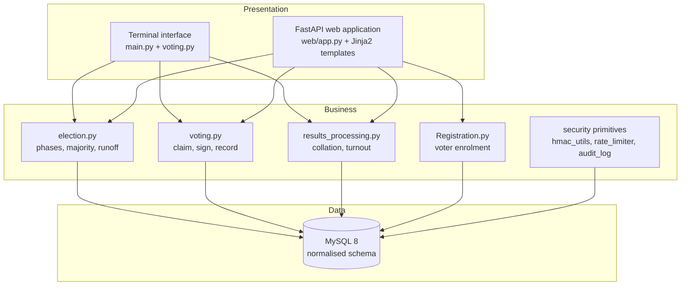
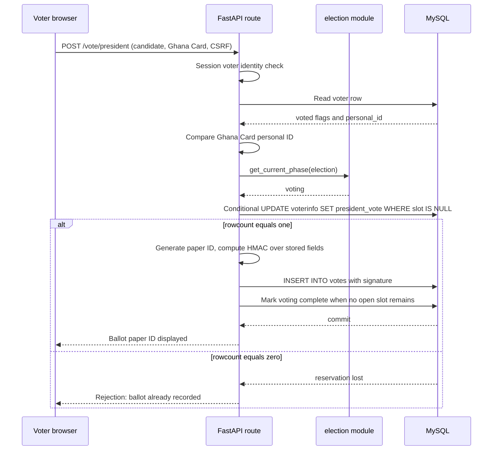
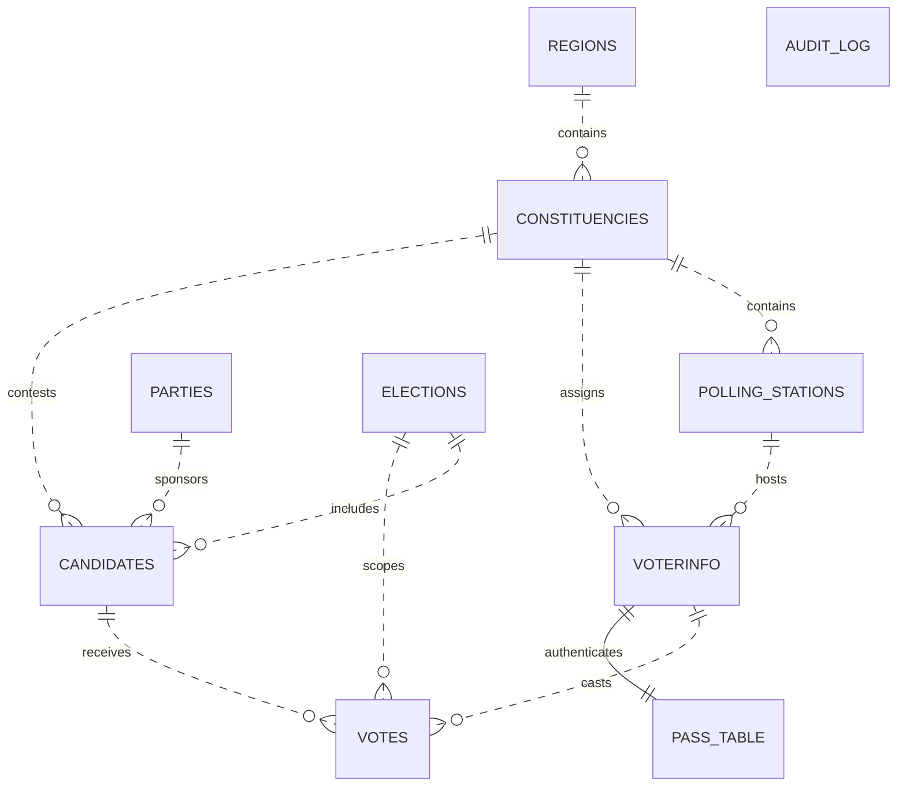
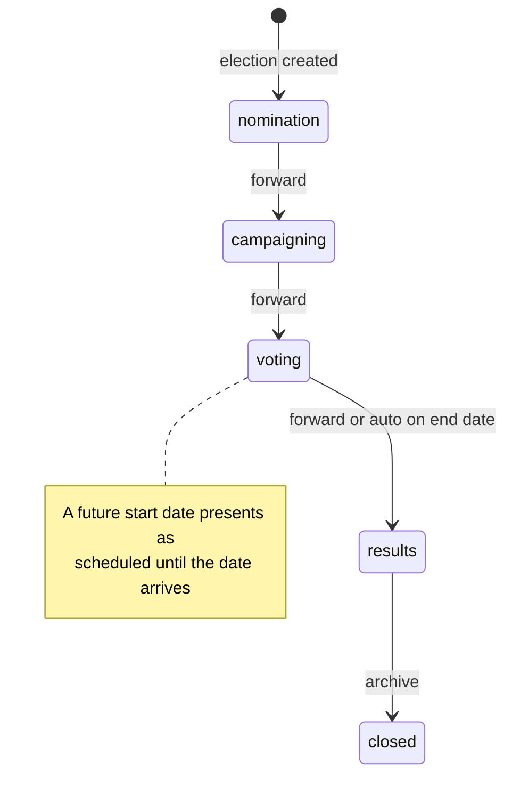
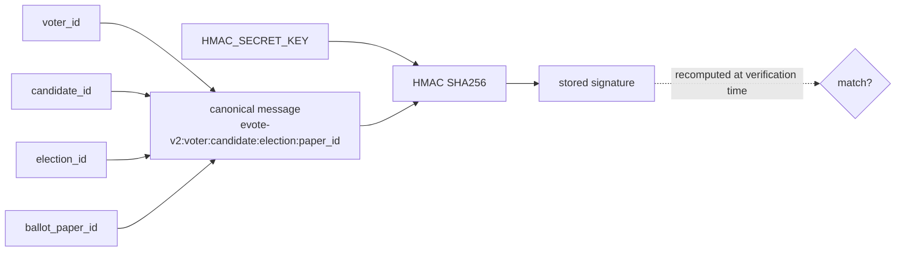
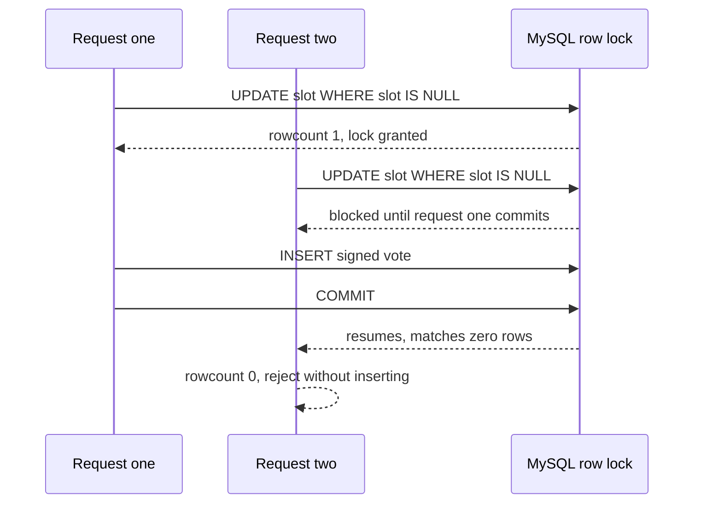
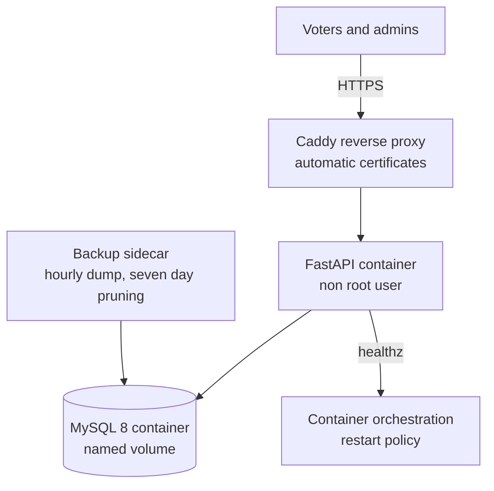

# Designing and Hardening an Electronic Voting System for the Ghanaian Electoral Context

## A Deep Architectural, Cryptographic, and Educational Study of eVoteGhana

**Abstract.** This thesis presents a complete analytical and constructive study of eVoteGhana, a prototype electronic voting system modelled on the electoral procedure of the Republic of Ghana. The work proceeds in three movements. First, it performs a systematic gap analysis of the codebase, exposing defects that range from a cryptographic signing scheme whose outputs could never be verified, through a time of check to time of use race that permitted double voting under concurrent load, down to an audit trail whose immutability existed only as a comment in the source. Second, it designs and implements remedies for each discovered defect, treating every repair as an occasion to teach the underlying principle from database theory, applied cryptography, software architecture, and election law. Third, it situates the finished artefact within the scholarly literature on end to end verifiable elections, stating plainly what a prototype can and cannot prove. The result is both a working system and a self contained curriculum in election engineering.

## Table of Contents

1. Introduction and Electoral Context
2. Requirements Analysis
3. System Architecture
4. The Data Model
5. The Election Lifecycle as a State Machine
6. Cryptographic Integrity of Ballots
7. Concurrency, Races, and the Atomic Claim Pattern
8. A Threat Model for the Prototype
9. Web Security Engineering
10. Verification Culture: Testing and Auditing
11. Deployment and Operations
12. Gap Analysis and Upgrades Performed
13. Honest Limitations
14. Future Work and the Research Frontier
15. Educational Exercises
16. Conclusion
17. References and Further Reading

## 1. Introduction and Electoral Context

### 1.1 Why Ghana is an instructive case study

Elections are among the most demanding workloads a computer system can face because the correctness requirement is absolute while the adversary is motivated. The Ghanaian context sharpens every lesson:

| # | Contextual fact | Engineering consequence |
|---|-----------------|-------------------------|
| 1 | Article 63(3) of the 1992 Constitution requires strictly more than fifty percent of valid votes to win the presidency | The majority check must be a strict inequality; fifty percent exactly is defeat, not victory |
| 2 | Article 63(5) mandates a runoff between the top two candidates when no majority emerges | Runoff detection alone is insufficient; the system must instantiate the second round |
| 3 | President and Member of Parliament are elected on the same day | Each voter holds two independent ballot slots that fill separately |
| 4 | Results are published on Form 1A (presidential) and Form 1C (parliamentary) | Collation output should mirror institutional paperwork |
| 5 | The Ghana Card personal identifier has the shape GHA plus ten alphanumeric characters | A natural second authentication factor and a natural uniqueness constraint |

### 1.2 Problem statement

Build a system that manages the complete lifecycle of a Ghanaian general election, from voter registration through candidate nomination, polling, collation, and archival, such that every recorded ballot is tamper evident, no voter can cast more than one ballot per contest even under concurrency, and every administrative action leaves evidence.

### 1.3 Objectives

1. Preserve and deepen the existing lifecycle model rather than replacing it.
2. Make every integrity claim mechanically enforceable, never merely documented.
3. Treat each defect found as a teaching opportunity with a named principle.
4. Keep the deployment story production shaped: containers, TLS, backups, health checks.
5. Document honestly what remains undone, because in election engineering false confidence is worse than admitted limitation.

### 1.4 Method

The study followed a fixed loop: read every module, derive the implicit security claims, test each claim mechanically or adversarially, design the minimal repair that makes the claim true, encode the repair in automated tests, then generalise the lesson. This mirrors the classical verification insight that a property worth stating is a property worth asserting automatically.

## 2. Requirements Analysis

### 2.1 Functional requirements

| ID | Requirement | Where satisfied |
|----|-------------|-----------------|
| F1 | Register voters with age, contact, Ghana Card validation, constituency, polling station | Registration module and web register endpoints |
| F2 | Administer regions, constituencies, stations, parties, candidates | CLI menus and admin setup routes |
| F3 | Manage election records through a five phase lifecycle | election.py |
| F4 | Cast MP and presidential ballots behind password plus Ghana Card MFA | voting.py and vote routes |
| F5 | Issue each ballot a public paper ID for later lookup | generate_ballot_paper_id |
| F6 | Sign every ballot so storage tampering is detectable | compute_vote_hmac |
| F7 | Collate constituency, regional, national results; render Forms 1A and 1C | results_processing.py |
| F8 | Instantiate a constitutional runoff between the top two candidates | create_runoff_election (new) |
| F9 | Report turnout against the registered roll | collate_turnout (new) |
| F10 | Let anyone verify a ballot by paper ID and see its cryptographic health | verify route and CLI item (upgraded) |
| F11 | Record administrative actions in an append only audit trail | audit_log.py plus triggers (new) |

### 2.2 Non functional requirements

| ID | Quality attribute | Concrete expression in the codebase |
|----|-------------------|-------------------------------------|
| N1 | Integrity | HMAC signatures over stored fields; append only audit log enforced by triggers |
| N2 | Availability | Container health checks; idempotent bootstrap with retries; hourly backups with pruning |
| N3 | Confidentiality | Bcrypt password hashing; HTTP only signed session cookies; no ballot content exposed without its paper ID |
| N4 | Least privilege | Non root container user; parameterised SQL everywhere; whitelisted table and column names |
| N5 | Auditability | Every state change logged with actor, action, record, and timestamp |
| N6 | Usability across languages | i18n catalogue with English, Twi, and Ewe menus |
| N7 | Maintainability | Single style enforced by ruff; CI gate on lint, format, and tests |

## 3. System Architecture

### 3.1 Layered view

The system is a deliberate three layer architecture: a presentation layer that exists twice (a legacy terminal interface and a FastAPI web application), one shared business layer holding every election rule, and one data layer that owns persistence. The decisive architectural move is that no lifecycle rule lives in either presentation surface.



### 3.2 Component responsibilities

| Component | Responsibility | Key invariant owned |
|-----------|----------------|---------------------|
| election.py | Phase transitions, majority arithmetic, runoff creation | Forward only lifecycle; close only from results |
| voting.py | Reserve slot, sign ballot, insert vote | One ballot per voter per contest, atomically |
| results_processing.py | Tallies at three levels, turnout, EC forms | Counts equal distinct vote rows exactly |
| hmac_utils.py | Ballot signing, paper IDs, integrity audits | Any altered vote row becomes detectable |
| rate_limiter.py | Sliding window attempt caps | Brute force cost grows linearly for attackers |
| audit_log.py | Append only event recording | History cannot be silently rewritten |
| web/security.py | Sessions, CSRF, admin gating | No unauthenticated administrative mutation |
| web/bootstrap.py | First run schema and admin provisioning | Restarting never corrupts an existing database |

### 3.3 The life of a ballot



## 4. The Data Model

### 4.1 Entity relationship view



| Table | Purpose | Notable constraints |
|-------|---------|---------------------|
| regions | The sixteen regions of Ghana, seeded | name unique |
| constituencies | Electoral districts within a region | foreign key to regions |
| polling_stations | Physical voting locations with unique codes | code unique |
| parties | Political parties | name unique |
| elections | Contests with position enum and phase enum | phase drives every gate |
| candidates | People contesting an election; null constituency means presidential | three foreign keys |
| voterinfo | Voter roll with two ballot slots | personal_id now UNIQUE |
| pass_table | Bcrypt password hashes keyed by voter | one to one with voterinfo |
| votes | Cast ballots with HMAC signature and paper ID | paper ID unique; four foreign keys |
| admins | Administrative accounts with roles | bcrypt hashes only |
| audit_log | Append only event history | update and delete forbidden by triggers |

### 4.2 Design lessons embedded in the schema

1. **Normalisation buys correctness.** Because constituencies reference regions rather than repeating region names, a spelling error cannot split one district into two during collation.
2. **Null as a meaningful state.** A candidate with a null constituency_id is presidential by definition. This single convention drives ballot selection, collation grouping, and runoff detection without extra tables.
3. **Two slots instead of one flag.** Storing mp_vote and president_vote separately lets the system answer the precise question of which races remain for a voter. A single voted flag would conflate the two contests.
4. **Uniqueness belongs in the storage engine.** The application level duplicate check for Ghana Cards was always vulnerable to the registration race described in Chapter 7; the new unique index makes duplicates physically impossible even if application code is bypassed.

## 5. The Election Lifecycle as a State Machine

### 5.1 States and permitted motion



### 5.2 The transition matrix

The upgraded rule set is deliberately stricter than its predecessor. Previously any phase could jump to closed, which allowed an operator to skip counting entirely; and backward transitions were rejected only by accident of ordering arithmetic.

| From \ To | nomination | campaigning | voting | results | closed |
|-----------|------------|-------------|--------|---------|--------|
| scheduled | yes | yes | yes | yes | no |
| nomination | no | yes | yes | yes | no |
| campaigning | no | no | yes | yes | no |
| voting | no | no | no | yes | no |
| results | no | no | no | no | yes |
| closed | no | no | no | no | no |

Two principles justify the strictness:

1. **Elections are irreversible in law**, so the software should make rewriting history awkward rather than convenient.
2. **Denied transitions are security events**, so every rejection is now recorded in the audit log with actor and attempted move, converting a silent failure into forensic evidence.

## 6. Cryptographic Integrity of Ballots

### 6.1 What went wrong in the original design

The original signing function computed an HMAC over voter identifier, candidate identifier, election identifier, and a timestamp. But the insert statement stored only the signature and paper ID. The timestamp itself was never persisted. Consequence: `verify_vote_hmac` was dead code in practice, because recomputation required a value that existed nowhere in the database. Every vote was signed with a key that could never be checked against anything.

This is a general lesson: **a signature over unrecorded data is theatre**. Verification requires the signed message to be reconstructible from persisted state alone.

### 6.2 The repaired scheme

The second generation scheme, tagged evote-v2 inside the message, signs exactly the four fields that are stored:



| Property | Guarantee provided | Guarantee not provided |
|----------|--------------------|------------------------|
| Tamper evidence | Any edit to voter, candidate, election, or paper ID breaks the signature | Knowledge of who edited |
| Verifiability | Anyone holding the secret key can audit all rows at any time | Public verifiability without the key |
| Binding | A signature cannot be transplanted onto another ballot row | Voter intent beyond the recorded candidate choice |

### 6.3 Why HMAC rather than something fancier

| Mechanism | Key type | Publicly verifiable | Fits prototype because |
|-----------|----------|---------------------|------------------------|
| Hash alone | none | no | No, trivially forgeable by anyone who can edit rows |
| Symmetric HMAC | shared secret | no, holders of key can also sign | Yes, single database means one trust boundary and cheap constant time verification |
| Digital signature | private key | yes | Possible but adds key distribution complexity without adding value while storage and signer are one process |
| End to end verifiable encryption | multiple keys | yes, cryptographically | The research frontier; Chapter 14 explains why it is out of scope here |

### 6.4 The integrity audit

Because signatures now cover only stored fields, the system can walk the entire votes table and recompute each row. `audit_votes_integrity` returns counts of valid and tampered rows together with their paper IDs. This converts integrity from an article of faith into a periodic report that costs one table scan.

## 7. Concurrency, Races, and the Atomic Claim Pattern

### 7.1 The bug that tests could not see

Both original flows read a voter row to decide whether voting was permitted, then later inserted the vote:

1. Read voter row; observe that the ballot slot is empty.
2. Verify Ghana Card and password.
3. Insert the vote and update the slot.

Between step 1 and step 3 lies a window. Two simultaneous submissions from the same session, produced by a double click or a replayed request, both pass the check in step 1 and both insert in step 3. The result is two counted votes for one voter. Unit tests never catch this because they run sequentially; only concurrent load exposes it. The defect class has a name: time of check to time of use.

### 7.2 The repair: make the decision inside one atomic statement

The repaired code never decides based on a previously read value. It reserves the slot with a single conditional update:

```sql
UPDATE voterinfo SET president_vote = %s
WHERE voter_id = %s AND president_vote IS NULL;
```

InnoDB serialises concurrent updates to the same row through its row lock, so exactly one of two racing statements can flip the slot from empty to filled. The application then checks the affected row count: one means this request owns the ballot and may insert the signed vote row; zero means some other request won, and this one must walk away without inserting anything. Both statements share one transaction, so a crash between them leaves either both effects or neither.

### 7.3 The pattern in one diagram



| Approach | Race safe | Complexity | Verdict |
|----------|-----------|------------|---------|
| Check then insert | no | low | The original bug |
| Global mutex around voting | yes | high across workers | Serialises all voters; unacceptable latency |
| Conditional update plus row count | yes | low | Chosen repair; one statement, engine enforced |

## 8. A Threat Model for the Prototype

### 8.1 STRIDE analysis

| Threat | Concrete attack on this system | Existing defence | Residual risk |
|--------|-------------------------------|------------------|---------------|
| Spoofing | Guess a voter password | Bcrypt cost factor, rate limits of five attempts per five minutes per identity and address | Stolen Ghana Card plus stolen password defeats MFA |
| Tampering | Edit a candidate total inside the votes table | HMAC over stored fields; integrity audit; audit log triggers forbid updates and deletes | An attacker holding both database and signing key can re-sign rows; key separation is essential |
| Repudiation | Admin denies having closed an election early | Phase transitions logged with actor and timestamps in an append only trail | Logs are only as durable as backups |
| Information disclosure | Enumerate ballot paper IDs to learn vote choices | Paper IDs are 96 bits of randomness; lookup reveals content only to whoever holds an ID | Anyone with a paper ID sees its choice by design for verification purposes |
| Denial of service | Flood the login endpoint | Sliding window rate limiting; reverse proxy buffering | In memory limiter resets on restart and splits state per worker |
| Elevation of privilege | Reach admin routes unauthenticated | Session gated dependency on every admin route; CSRF token on every form; security headers | Compromise of the session secret breaks everything at once |

### 8.2 Reading the table honestly

Two rows deserve emphasis. First, tamper evidence is not tamper prevention: cryptography detects alteration after the fact but cannot stop a database administrator from altering and re-signing. That residual risk is precisely why the audit log exists as a second, structurally different line of defence. Second, the disclosure row encodes a genuine design tension between verifiability and secrecy that real electoral commissions manage with physical procedures; Chapter 13 revisits it.

## 9. Web Security Engineering

### 9.1 Defence in depth inventory

| Layer | Control | Implementation site |
|-------|---------|---------------------|
| Transport | Automatic TLS via Caddy; HSTS preload | Caddyfile |
| Session | Server signed, HTTP only cookies with SameSite Lax and configurable Secure flag | SessionMiddleware |
| CSRF | Per session token compared in constant time on every POST | web/security.py csrf dependency |
| Authentication | Bcrypt hashes for voters and admins; Ghana Card as second factor at ballot time | Registration.py, voting.py |
| Authorisation | require_admin dependency guarding every admin route | web/security.py |
| Abuse control | Sliding window limiters per identity and address on login and registration | rate_limiter.py |
| Headers | nosniff, frame denial, referrer policy, strict content security policy without inline script | SecurityHeadersMiddleware |
| Data access | Parameterised statements exclusively; table and column whitelists for dynamic lookups | mysql_value_checker.py, mysql_delete.py |
| Container | Non root user; health checks; internal only exposure behind proxy | Dockerfile, compose file |

### 9.2 The lesson of boring uniformity

None of the individual controls is novel. The engineering value lies in their uniform application: every form carries a CSRF token because it is attached through a shared dependency rather than remembered per route, and every query is parameterised because the data access object makes the safe path the easy path. Security architecture succeeds when the convenient way is also the safe way.

## 10. Verification Culture: Testing and Auditing

### 10.1 What the suite proves

The test suite grew alongside every repair. Each new invariant arrived holding hands with the test that would fail if the invariant regressed.

| Suite | Focus | Representative guarantee |
|-------|-------|--------------------------|
| test_integrity.py (new) | Signature scheme and integrity audit | Editing any stored field flips verification to failure |
| test_election_rules.py (new) | Transition matrix, majority arithmetic, runoff seeding | Closing from nomination is impossible and logged |
| test_core.py | Threshold maths, rate limiter, paper ID shape | Exactly half of votes is not a win |
| test_voting.py | Ballot flow including double vote rejection | A lost slot claim inserts nothing |
| test_registration.py | Enrolment rules and ID regeneration | Underage applicants are refused |
| test_security.py | Validation primitives and i18n fallback | Malformed tables and columns raise before reaching SQL |
| test_web_app.py | Route smoke tests over a mocked database | Anonymous users never reach the dashboard |

### 10.2 Static analysis as a second net

Continuous integration runs ruff lint and format gates before tests. The gate caught real issues during this study, including an invalid configuration key that had silently disabled part of the toolchain, unused imports hiding dead dependencies, and long SQL strings that hid copy paste divergence. Static analysis is cheap insurance against the slow decay of codebases that nobody dares reformat.

## 11. Deployment and Operations



| Operational concern | Mechanism | Educational point |
|---------------------|-----------|-------------------|
| First run provisioning | Idempotent bootstrap creating schema, seeds, triggers, initial admin | Startup code must tolerate being run twice on any host at any time |
| Schema evolution | information_schema probes add missing columns, indexes, and triggers on boot | Migration without downtime begins with idempotent convergence |
| Backup discipline | Hourly compressed dumps plus on demand backup endpoint | An untested backup is a rumour, not a capability |
| Failure visibility | healthz distinguishes ok from degraded; structured request logs with latencies | Health endpoints must exercise the dependency, not just the process |
| Secret hygiene | Environment sourced keys; placeholder values refused in production paths | Ephemeral defaults should fail loudly rather than quietly persist |

## 12. Gap Analysis and Upgrades Performed

### 12.1 The register of defects

| # | Gap discovered | Severity | Principle violated | Repair delivered |
|---|----------------|----------|--------------------|------------------|
| 1 | HMAC signed a timestamp that was never stored, so no signature could ever be verified | critical | Signatures must cover persisted state | evote-v2 scheme over the four stored fields plus integrity audit function |
| 2 | Check then insert voting flow allowed double voting under concurrency | critical | Atomicity of decision and effect | Conditional update slot claim with row count gate in one transaction |
| 3 | Audit log immutability was a documentation claim, not a mechanism | high | Structural enforcement beats intention | BEFORE UPDATE and BEFORE DELETE triggers raising SQLSTATE errors |
| 4 | Any phase could transition to closed, skipping counting entirely | high | Least privilege over state | Forward only matrix; closed reachable only from results; denials logged |
| 5 | Runoff detection existed but runoff conduct did not | medium | Complete lifecycle coverage | create_runoff_election seeding top two candidates into a fresh contest |
| 6 | Duplicate Ghana Cards blocked only by racy application check | medium | Uniqueness belongs to storage | Unique index on personal_id with idempotent migration on boot |
| 7 | Random voter ID collisions aborted registration | low | Graceful degradation | Bounded retry with fresh IDs before failing |
| 8 | No turnout reporting despite i18n strings anticipating it | low | Finish the feature | collate_turnout with registered, cast, percentage surfaced on results pages |
| 9 | Ballot verification asserted presence without proving integrity | medium | Verification should verify | Both web and CLI verification recompute signatures and report health |
| 10 | Web container ran as root | medium | Least privilege at runtime | Dedicated system user owns the application directory |
| 11 | Ruff configuration contained an invalid key, disabling the toolchain | medium | Tooling must actually run | Key relocated; policy tuned with documented rationale |
| 12 | Voting completion flag set only after presidential ballot | low | State must reflect reality | Completion computed from open slots rather than one race |

### 12.2 Narrative on the two critical repairs

The signature repair matters because it changes what the database can prove. Before it, an operator who suspected tampering had nothing to compare against. After it, every row carries its own witness, and suspicion can be converted into evidence by running one function. The atomic claim repair matters because it closes the gap between what sequential testing shows and what concurrent reality does. Together they illustrate the thesis that correctness properties must be carried by structure, whether the structure is a message format or a row lock, rather than by the hopes of calling code.

## 13. Honest Limitations

A thesis that lists only victories is propaganda. The following limitations are real and material:

1. **Ballot secrecy is structural.** The votes table stores the voter identity beside the candidate choice. Anyone with database read access can learn how every voter voted. Real systems separate the roll from the ballot box, either physically or cryptographically. The prototype links them deliberately so that verification by paper ID can demonstrate integrity, which is a teaching trade off, not a production one.
2. **The rate limiter is per process memory.** With multiple workers each process counts separately, and a restart forgets all counts. A production deployment would move counters into the shared database or a cache with atomic increments.
3. **HMAC verification assumes key custody.** Whoever holds the signing key can re-sign altered rows. Splitting duties across operators, or adopting public key signatures where only an offline key can sign, would reduce this.
4. **Verification reveals content to ID holders.** The verify endpoint shows what a paper ID chose, because that is its purpose in this prototype; a production design would show only cryptographic health plus a commitment, never the plaintext choice.
5. **The i18n catalogue is thin outside English.** Twi and Ewe entries cover a fraction of keys; fallback masks the gaps silently. Completion requires native speaker review rather than engineering effort.
6. **No formal model.** The state machine and claim protocol are argued informally. A TLA Plus or Alloy model would permit exhaustion over interleavings rather than sampling them with tests.

## 14. Future Work and the Research Frontier

### 14.1 End to end verifiable voting

The literature offers schemes such as Helios and Belenios where voters obtain encrypted receipts, tallying happens under homomorphic or mix net encryption, and anyone can verify the arithmetic without trusting the server. Adopting such a scheme would dissolve several residual risks from Chapter 8 but would also demand voter education, since receipt handling confuses real electorates. A sensible intermediate step for this codebase is publishing a signed, append only bulletin of commitments so that external observers can at least detect rollbacks.

### 14.2 Biometric deduplication

Ghanaian elections employ biometric verification devices at polling stations. Adding fingerprint or facial match against the Ghana Card registry would strengthen the spoofing defence, at the cost of storing sensitive templates, which introduces its own data protection obligations. Engineering judgement is about pricing these trades honestly.

### 14.3 Distributed rate limiting and observability

Moving abuse control into shared storage with atomic windows, and adding structured audit export, would make horizontal scaling safe. Metrics on phase transition denials and failed Ghana Card matches would give operators early warning of both attacks and usability problems.

### 14.4 Formal verification

Modelling the lifecycle and claim protocol formally would let future maintainers prove that no sequence of admin actions can close an election before results, or that two ballots can never share one slot, independent of implementation drift.

## 15. Educational Exercises

For learners using this repository as a curriculum:

1. **Trace the race.** Write a two threaded test that submits identical ballots concurrently against a stubbed database layer, observe the double count, then re run against the conditional update logic and explain the difference in terms of row locks.
2. **Break and catch.** Modify a stored vote row directly in SQL, run the integrity audit, and write down exactly which fields you had to change before detection failed.
3. **Constitutional arithmetic.** Construct tallies of 100 votes split as fifty and fifty versus fifty one and forty nine, predict the winner and runoff verdicts, then check against check_50_percent_plus_one.
4. **Close early attack.** Attempt to move an election from nomination straight to closed through the web interface, then find the denial inside the audit log and identify the actor recorded.
5. **Design the separation.** Sketch a schema that separates the voter roll from cast ballots while still permitting paper ID lookup, and analyse how your design changes the information disclosure row of the threat table.
6. **Prove idempotence.** Run the bootstrap twice in a row and enumerate which statements were safe to repeat and why the triggers are dropped before creation.

## 16. Conclusion

The study set out to analyse a working prototype, fill its gaps, and teach what the gaps taught. Twelve defects were found, each traced to a violated principle rather than a mere slip: signatures covered unrecorded data, decisions preceded their effects in time, immutability lived in comments, lifecycle power lacked least privilege, and so on. Every repair was structural. The signature scheme now spans only stored fields; the slot claim now happens inside one guarded statement; the audit log now refuses mutation inside the engine; the state machine now forbids its most dangerous edge.

The deeper conclusion is methodological. Election engineering is not distinguished by exotic cryptography but by the discipline of converting every promise into a mechanism and every mechanism into a test. A prototype that follows this discipline is honest about what it cannot do, which is precisely what makes it trustworthy for learning and a defensible foundation for future work.

## 17. References and Further Reading

1. Constitution of the Republic of Ghana, 1992, Article 63, presidential election and runoff provisions.
2. Adida, B., Helios: Web based Open Audit Voting, USENIX Security, 2008.
3. Cortier, V. and Lalle, J., Belenios, a protocol for end to end verifiable elections, Journal of Information Security and Applications, 2022.
4. Juels, A., Catalano, D., Jakobsson, M., Coercion Resistant Electronic Elections, ACM Workshop on Privacy in the Electronic Society, 2005.
5. Bernhard, M. et al., Public Evidence from Secret Ballots, arXiv survey on end to end verifiable elections, 2017.
6. Kelsey, J., Regenscheid, A., Moran, T., Chailloux, A., Cryptographic Principles for Voting Systems with Ballot Secrecy, IEEE Security and Privacy Workshops, 2020.
7. MySQL 8.0 Reference Manual, InnoDB Locking and Trigger Syntax and Examples.
8. FastAPI documentation, Sessions, Middleware, and Dependencies.
9. OWASP Application Security Verification Standard, sections on authentication, session management, and access control.
10. Provos, N. and Mazieres, D., A Future Adaptable Password Scheme (bcrypt), USENIX Annual Technical Conference, 1999.

*Prepared as part of the eVoteGhana prototype study, August 2026.*
