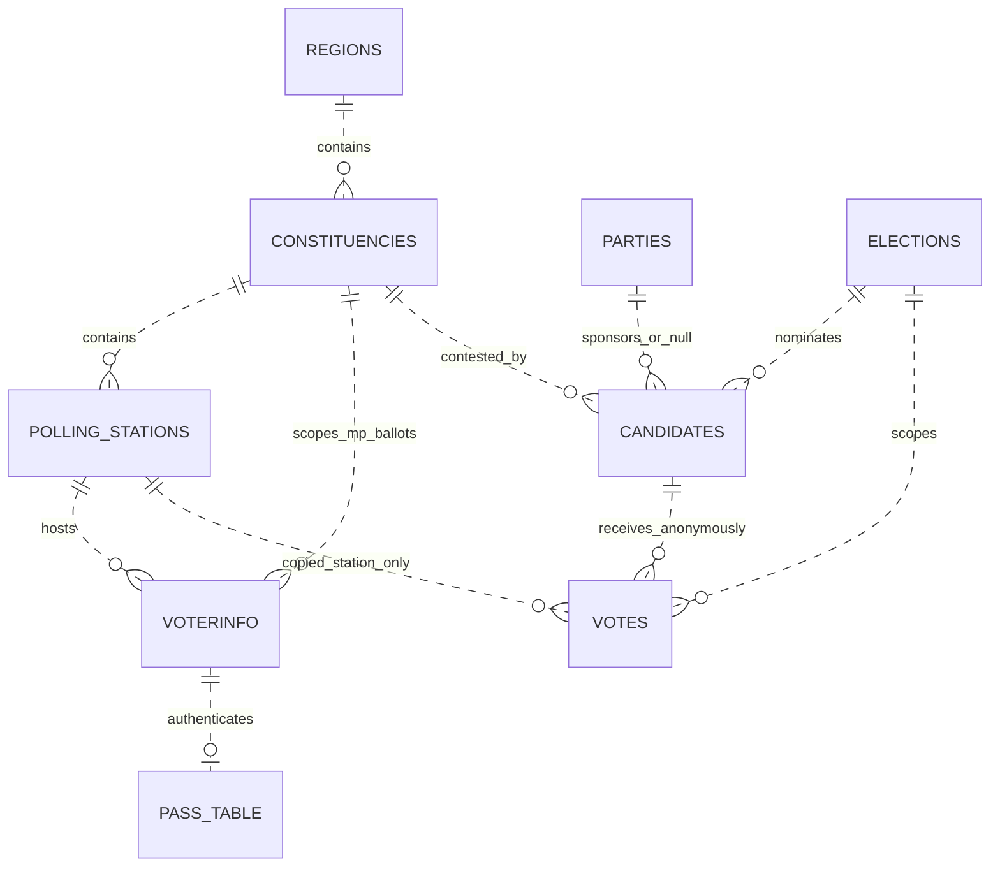
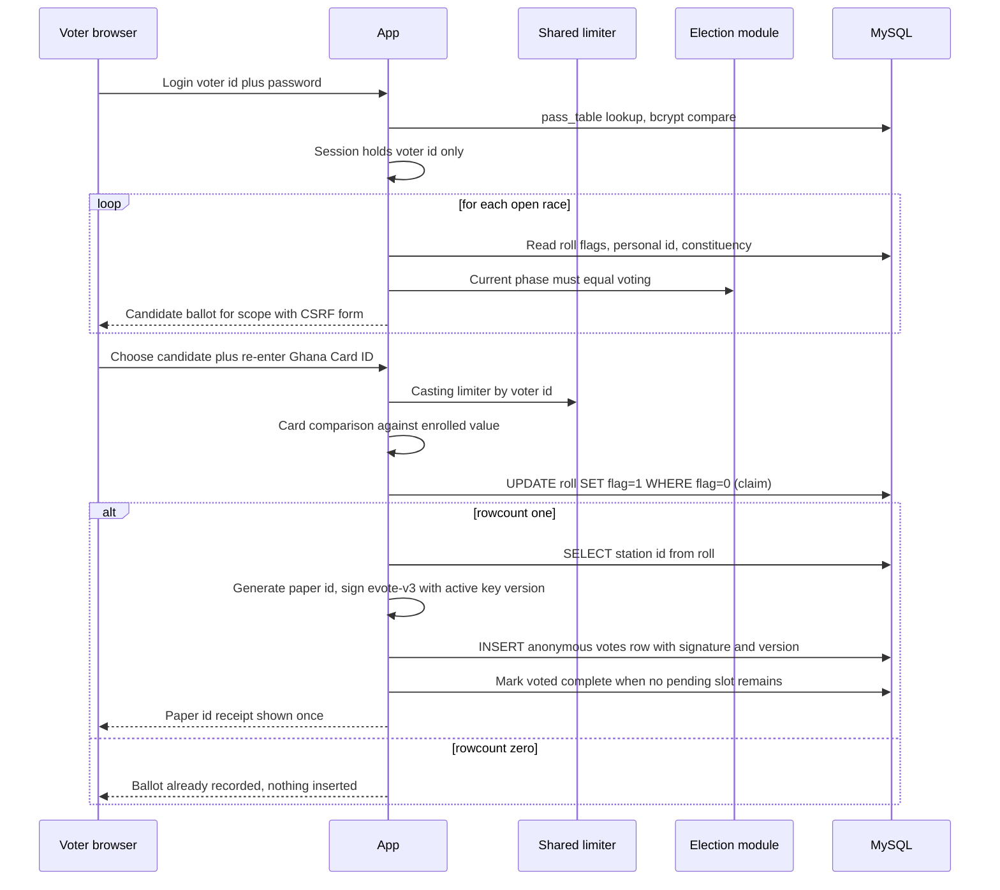
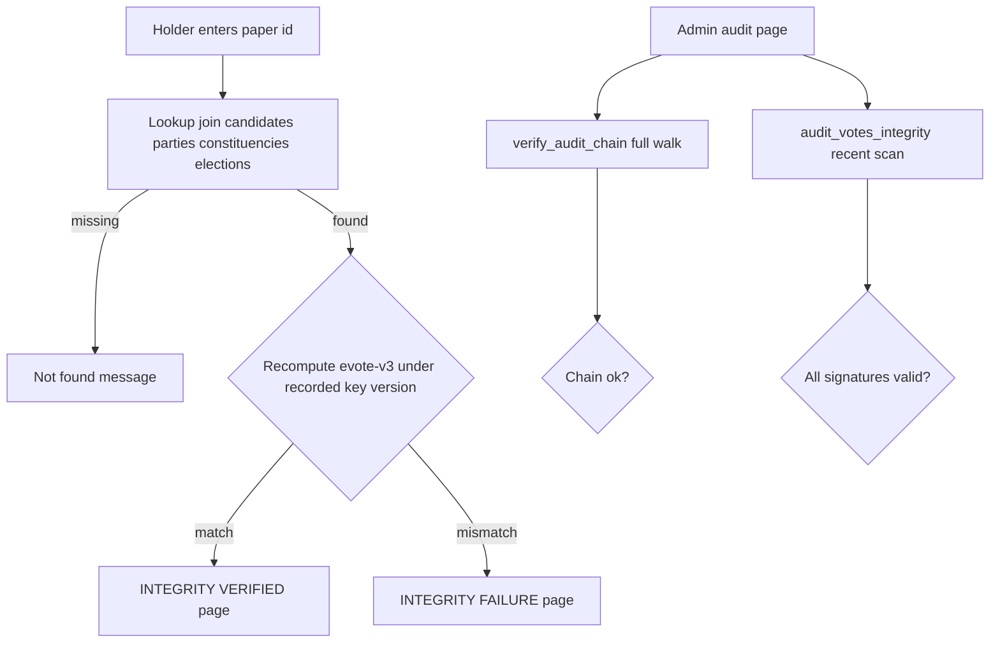
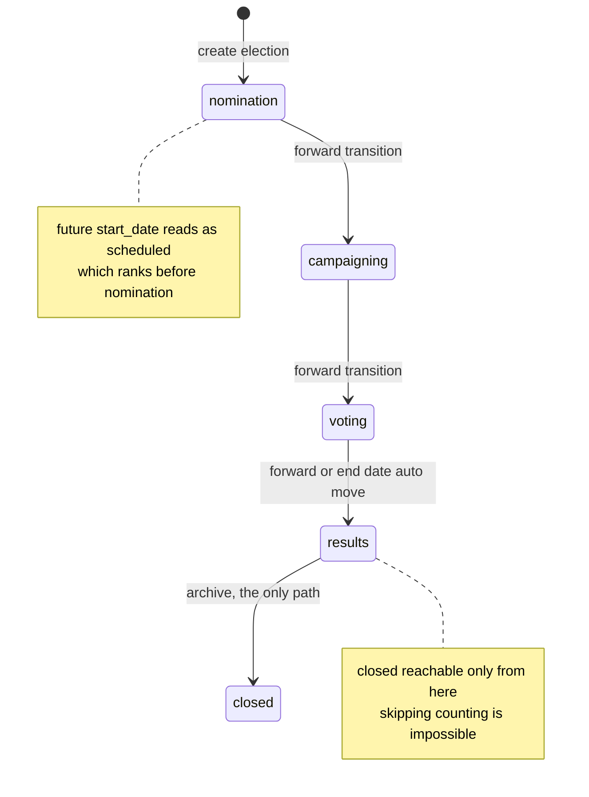

# Designing and Hardening an Electronic Voting System for the Ghanaian Electoral Context

## A Complete Engineering Thesis on eVoteGhana: Every Decision, Every Technology, Every Trade Off

**Abstract.** This thesis documents eVoteGhana, a prototype electronic voting system modelled on the electoral procedure of the Republic of Ghana, at production shaped maturity. It is written to be exhaustive: every technology is named and weighed against its realistic alternatives, every architectural decision is recorded with context, options, decision, and consequences in Architecture Decision Record form, every database column is specified, every security control is traced to the threat it answers, and every remaining limitation is stated plainly. The system remains an educational artefact; the checklist for real world deployment, including certification and legal authorisation beyond software, is included precisely so the reader learns where engineering ends and institutions must continue.

## How To Read This Thesis

| Reader | Recommended path |
|---------|------------------|
| Instructor grading a capstone | Chapters 1 through 9, then 18 and 21 |
| Engineer joining the project | Chapters 4 through 13, then RUNBOOK.md |
| Security reviewer | Chapters 8, 9, 14, 15, 16 |
| Student learning software engineering | Read linearly; every chapter names its lessons |
| Election administration practitioner | Chapters 2, 13, 16, 19 |

## Table Of Contents

1. Introduction, Scope, and Method
2. Requirements Engineering
3. The Complete Technology Stack
4. Decision Records: Format and Register
5. Platform and Process Decisions
6. Data Layer Decisions
7. Security Decisions
8. Cryptographic Decisions
9. Application Design Decisions
10. Tooling and Quality Decisions
11. Complete Data Dictionary
12. End To End Flows
13. Business Rules Reference
14. Threat Model
15. Performance and Capacity Analysis
16. Data Protection and Compliance
17. Verification Culture: The Test Suite Map
18. Honest Limitations Register
19. Research Frontier
20. Glossary
21. Educational Exercises
22. References

## 1. Introduction, Scope, and Method

### 1.1 Purpose and audience

The purpose of this document is threefold. First, it serves as the definitive engineering record of eVoteGhana such that a competent developer could reconstruct every component and justify every choice without interviewing an author. Second, it functions as a curriculum: each chapter extracts transferable lessons from Ghana specific requirements, from database theory, from applied cryptography, and from operations practice. Third, it is an honesty instrument; by enumerating limitations with the same care given to features, it models the professional norm that trust in election infrastructure is earned through disclosed evidence rather than confident prose.

### 1.2 Why the Ghanaian context is instructive

| # | Contextual fact | Engineering consequence in this system |
|---|-----------------|----------------------------------------|
| 1 | Article 63(3) of the 1992 Constitution: a presidential candidate wins only with more than fifty percent of all valid votes cast | Majority check is a strict inequality; fifty percent exactly is defeat |
| 2 | Article 63(5): if no majority, a runoff between the top two is held | The system must instantiate a second election seeded with exactly two candidates |
| 3 | Article 49 guarantees secrecy of the ballot | Storage design must make voter choice unrecoverable even from full database access |
| 4 | President and Members of Parliament are elected on the same day | Each voter owns two independent ballot slots filled separately |
| 5 | The Electoral Commission collates at polling station, constituency, regional, and national levels | Collation queries aggregate along a region to constituency hierarchy |
| 6 | Results are published on Form 1A (presidential) and Form 1C (parliamentary) | Output renders these forms so software output maps onto institutional paperwork |
| 7 | Biometric verification devices have screened electors since 2012 | Ghana Card personal ID serves as the second authentication factor here |
| 8 | Ghana Card identifiers take the form GHA followed by ten alphanumeric characters | Validation regex and a storage level uniqueness constraint derive from this shape |
| 9 | Elections are constitutionally ordered cycles, not ad hoc events | A five phase lifecycle governs what actions are legal at which moment |

### 1.3 Scope boundaries stated up front

Software can deliver correctness properties; it cannot deliver institutional legitimacy. This repository can be production shaped for controlled deployments such as organisational and institutional elections inside trusted networks. Public national deployment additionally requires Electoral Commission authorisation, certification against applicable standards, independent penetration testing and cryptographic review, physical security procedures, and statutory compliance work. Chapter 18 states remaining technical limits; PRODUCTION_CHECKLIST.md separates what is done, what is documented but unautomated, and what lies outside software entirely.

### 1.4 Method: claim, mechanism, test

Development proceeded in a fixed loop. Read a module and write down its implicit security or correctness claims. Attempt to break each claim adversarially or prove it mechanically. Design the minimal structural repair that makes the claim true by construction rather than by convention. Encode the property in an automated test so regression is impossible silently. Generalise the lesson into documentation. Every decision record in Part II was produced by this loop, and chapter 17 shows the resulting test map.

## 2. Requirements Engineering

### 2.1 Actors and personas

| Actor | Persona sketch | Primary needs | Trust level assumed |
|-------|----------------|---------------|---------------------|
| Voter | An adult citizen registered in one constituency with one polling station | Register once, authenticate, cast two ballots without coercion risk, later verify a ballot by paper ID | Untrusted client; may double click, share devices, forget credentials |
| Poll administrator | EC style officer configuring an election day | Create elections and geography, nominate candidates, move phases, inspect audit trail | Authenticated; least privilege role; actions logged |
| System operator | Technical staff running the deployment | Health visibility, backups, key rotation, incident response | Full administrative trust; all actions still audited |
| Public observer | Any person holding a ballot paper ID | Verify that a ballot exists and is cryptographically intact | Zero trust; rate limited read only |
| Adversary | Motivated insider or outsider | Learn individual choices, alter totals, disrupt availability, erase evidence | Assumed present; drives chapters 8, 9, 14 |

### 2.2 Functional requirements

| ID | Requirement | Satisfying components |
|----|-------------|----------------------|
| F1 | Register voters with legal age check, Ghanaian contact format, optional email, Ghana Card format and global uniqueness, constituency and polling station assignment, strong password | Registration module, web register routes, validation module |
| F2 | Administer the sixteen regions of Ghana as seed data plus constituencies, polling stations with unique codes, parties, and candidates including independents | Schema seeds, CLI menus, admin setup routes |
| F3 | Manage election records through a five phase lifecycle with forward only transitions | Election module transition matrix |
| F4 | Cast MP ballots scoped to the voter constituency and presidential ballots nationally behind password plus Ghana Card verification | Voting module claim and record functions, vote routes |
| F5 | Issue each ballot a public random paper identifier for later lookup | Paper id generator, 48 bit entropy analysis in chapter 8 |
| F6 | Sign every ballot over persisted anonymous fields with versioned keys so tampering is detectable forever | Crypto module scheme evote-v3 |
| F7 | Prevent any voter casting twice per contest even under simultaneous submissions | Conditional update slot claims inside transactions |
| F8 | Keep ballot secrecy at storage level: no row anywhere maps a voter to a choice | Anonymous votes table design, chapter 6 ADR 017 |
| F9 | Collate constituency, regional, national tallies; compute turnout; render Forms 1A and 1C; detect runoffs | Results processing module |
| F10 | Instantiate a constitutional runoff election seeded with the top two candidates | Runoff creation function, admin route |
| F11 | Record every administrative action in a tamper evident append only chain | Audit module plus triggers plus hash chain verifier |
| F12 | Let anyone verify a ballot by paper ID and see signature health | Verify route and CLI menu item |
| F13 | Enforce abuse limits on authentication, registration, and casting shared across workers | Database backed sliding window limiter |
| F14 | Provide admin second factor authentication with enrollment and removal flows | TOTP routes, security page |

### 2.3 Non functional requirements

| ID | Quality attribute | Concrete expression |
|----|-------------------|---------------------|
| N1 | Integrity | Signatures over stored fields; chained audit log; trigger enforced immutability |
| N2 | Ballot secrecy | No storage path maps voter identity to candidate choice; verified by test asserting identical signatures across hypothetical voters |
| N3 | Availability | Health endpoint exercising dependencies; idempotent bootstrapping; hourly backups; fail open abuse controls |
| N4 | Confidentiality | Bcrypt hashes; signed HTTP only cookies; no ballot content exposed except to paper ID holders by design |
| N5 | Least privilege | Dedicated application database user; non root container; whitelisted identifiers; role enum on admins |
| N6 | Auditability | Actor, action, table, record, details, canonical timestamp, and chain links on every event |
| N7 | Maintainability | Single lint and format toolchain; decision records; data dictionary; flat importable modules |
| N8 | Usability | Server rendered accessible forms; flash messaging; three language menus with fallback |
| N9 | Operability under rotation | Key ring with active pointer; per row versions; documented procedure |
| N10 | Testability | Business logic isolated from presentation; database access concentrated behind one seam for mocking |
| N11 | Portability | Containerised stack; environment driven configuration; no host state beyond volumes |
| N12 | Performance headroom | Pooling; indexed hot paths; capacity analysis in chapter 15 |

### 2.4 Explicit non goals

| Goal excluded | Reason |
|---------------|--------|
| Internet voting from unverifiable client devices for public elections | Coercion and malware make it unsolved even in research; out of scope until end to end verifiable receipting exists, see chapter 19 |
| Candidate nomination workflows with signatures and fees | Institutional process outside system boundary in this prototype |
| SMS or email delivery of credentials | Introduces provider dependency and new attack surface; passwords are set at registration |
| Real time results during voting phase | Lifecycle rules deliberately withhold results until the results phase |
| Multi tenant support | One deployment serves one electoral event family; tenancy would complicate every integrity guarantee |
## 3. The Complete Technology Stack

### 3.1 Inventory

| Layer | Technology | Version range | Role | License |
|-------|-----------|---------------|------|---------|
| Language runtime | Python | 3.12 | All application code; stdlib covers hashing, secrets, datetime | PSF |
| Web framework | FastAPI | 0.110 to 1.0 | Route declarations, dependency injection, request validation, OpenAPI gating | MIT |
| ASGI toolkit | Starlette (via FastAPI) | matched | SessionMiddleware, BaseHTTPMiddleware, responses | BSD |
| Templating | Jinja2 | 3.1 to 4.0 | Server rendered HTML with autoescaping | BSD |
| ASGI server | Uvicorn with standard extras | 0.29 to 1.0 | Multi worker process model, uvloop and httptools acceleration | BSD |
| Forms parsing | python-multipart | 0.0.9 plus | Multipart and urlencoded form bodies | Apache 2.0 |
| Sessions signing | itsdangerous | 2.1 to 3.0 | Signed compressed cookie payloads inside SessionMiddleware | BSD |
| Database | MySQL | 8.0 container | Relational storage, InnoDB transactions, triggers | GPL commercial dual |
| Driver | mysql-connector-python | 8.3 to 9.0 | Pure Python driver, connection pooling, buffered cursors | GPLv2 with FOSS exception |
| Password hashing | bcrypt library | 4.1 to 5.0 | Cost factor 12 class adaptive hashing | Apache 2.0 |
| Two factor | pyotp | 2.9 to 3.0 | RFC 6238 TOTP generation and verification | MIT |
| Configuration | python-dotenv | 1.0 to 2.0 | .env loading for local runs | BSD |
| Crypto primitives | hashlib, hmac, secrets from stdlib; cryptography pinned in requirements as transitive assurance | stdlib; 41 to 43 | SHA256, HMAC, random tokens | PSF, Apache/BSD |
| Reverse proxy | Caddy | 2 alpine | Automatic ACME TLS, HTTP to HTTPS redirect, compression, HSTS | Apache 2.0 |
| Packaging | Docker with Compose | current stable | Four service topology, named volumes, healthchecks | Apache 2.0 |
| Testing | pytest | 8.x line | Test runner, fixtures, monkeypatch | MIT |
| HTTP client for tests | httpx | 0.27 to 1.0 | Starlette TestClient transport | BSD |
| Lint and format | ruff | 0.4 line | Unified checker replacing flake8, isort, black roles | MIT |
| Git hooks | pre-commit with ruff hooks | v0.4.4 pin | Local enforcement before CI | MIT |

### 3.2 Versioning and pinning policy

Application dependencies are constrained by ranges in requirements.txt rather than exact pins because this prototype values reproducible minor updates over lockfile ceremony; a production fork would add a lock file via pip tools or uv. Infrastructure images are pinned by tag (mysql:8.0, caddy:2-alpine) and would be pinned by digest in a hardened fork. Python is fixed at 3.12 in CI matrix so syntax such as builtin generics without imports remains valid.

### 3.3 Dependency minimization rationale

Every added dependency enlarges the trusted computing base and the audit surface. The stack deliberately refuses: an ORM (queries are few, hand written, and reviewed), a task queue (no asynchronous jobs exist; backups are cron sidecars), a caching server (no read path needs one yet), a CSS or JavaScript build chain (server rendered pages only), and an email or SMS provider (no outbound messaging). The only additions beyond the framework minimum were bcrypt, pyotp, and the driver itself, each justified by a specific requirement F1, F14, and N11 respectively.

## 4. Decision Records: Format and Register

Each decision below follows a compact Architecture Decision Record shape: Context names the forces; Options lists realistic alternatives with rejection reasons; Decision states what was chosen; Consequences state both benefit and cost. Status is Accepted for all entries unless marked otherwise.

| Range | Domain | Count |
|-------|--------|-------|
| ADR 001 to 010 | Platform and process | 10 |
| ADR 011 to 022 | Data layer | 12 |
| ADR 023 to 036 | Security engineering | 14 |
| ADR 037 to 046 | Cryptography and integrity | 10 |
| ADR 047 to 057 | Application design | 11 |
| ADR 058 to 065 | Tooling and quality | 8 |

Sixty five decisions are recorded. Where an earlier decision was later reversed, such as ballot signatures including voter identity, the reversal is recorded as a superseding entry rather than silently rewritten, because decision history is itself audit evidence.

## 5. Platform and Process Decisions

### ADR 001 Python 3.12 single language
Context: a prototype needing rapid iteration, strong crypto libraries, and readable teaching code.
Options: Node.js (fast iteration, weaker stdlib crypto posture for this domain); Go (excellent deployment story, more ceremony for forms heavy CRUD); Java/Spring (enterprise fit, heavy for education).
Decision: Python 3.12 everywhere from CLI to web to tests.
Consequences: one mental model across layers and rich libraries; cost is interpreted performance, acceptable at documented scale, and Global Interpreter Lock, irrelevant because concurrency is delegated to MySQL row locks rather than shared memory.

### ADR 002 FastAPI over Django, Flask, Litestar
Options: Django (batteries include admin and ORM we deliberately reject; would drag migrations and templates conventions contrary to our raw SQL stance); Flask (minimal but dependency injection and async support require assembly); Litestar (strong alternative, smaller ecosystem for teaching references).
Decision: FastAPI with Starlette middleware stack and Jinja2Templates.
Consequences: typed route handlers with Form validation reduce boilerplate; Depends provides the security seams used for CSRF and admin gating; cost is that sync def handlers run in a threadpool, fine given every request blocks on MySQL anyway.

### ADR 003 Server rendered HTML with zero application JavaScript
Context: election UIs must be auditable line by line; build chains enlarge the trusted base.
Decision: Jinja2 templates extending one base layout, one external stylesheet, no inline script or style, no client framework.
Consequences: the entire user facing attack surface is HTML and forms; CSP can forbid inline everything; accessibility comes free from semantic forms. Cost: no reactive niceties such as live candidate filtering, acceptable and arguably desirable for clarity.

### ADR 004 Two presentation frontends over one business core
Decision: retain the terminal interface alongside the web app; both import the same election, voting, results, and registration modules.
Consequences: demonstrates layered architecture pedagogically; CLI doubles as an operations escape hatch when HTTP is broken. Cost: duplicated interaction logic only, never duplicated rules; the CLI keeps process local limiters while web uses shared ones by design.

### ADR 005 Flat module layout without packages
Options: src layout with packages per layer; flat modules in repository root plus a web package.
Decision: flat top level modules for the core, a web package for HTTP concerns, tests mirroring at root.
Consequences: imports read like the architecture diagram; ruff and pytest configuration stays trivial. Cost: namespace collision risk grows with size; acceptable below roughly twenty core modules and revisited in chapter 19.

### ADR 006 Synchronous handlers throughout
Decision: every route and business function is plain synchronous def; no await anywhere.
Consequences: transactional code reads linearly which matches database semantics; Uvicorn still serves concurrent requests via its threadpool for sync endpoints. An asyncio rewrite would complicate driver usage since the chosen connector is synchronous.

### ADR 007 No background job infrastructure
Options: Celery or APScheduler inside the container; cron sidecar.
Decision: the backup sidecar container runs cronie invoking mysqldump hourly; end date auto transition happens lazily during phase reads rather than via scheduler.
Consequences: one less service class to monitor; lazy transitions mean a phase can appear stale until read, documented in chapter 13. Costs nothing today; revisit if real scheduled notifications arrive.

### ADR 008 Four service Compose topology
Decision: db (MySQL), web (application), caddy (edge), backup (sidecar) with named volumes mysql_data, caddy_data, caddy_config, backup_data; depends_on conditions gate startup on healthchecks; restart policy unless stopped everywhere.
Consequences: docker compose up yields a complete TLS enabled deployment; volumes isolate state so containers stay disposable.

```mermaid
flowchart TB
    U["Voters, admins, observers"] -->|"HTTPS 443"| C["Caddy edge<br/>automatic ACME certificates, HSTS"]
    C --> W["web container<br/>uvicorn workers, non root evote user"]
    W -->|"pool of connections"| D[("db container<br/>MySQL 8 InnoDB<br/>mysql_data volume")]
    BK["backup sidecar<br/>cron hourly mysqldump gzip<br/>seven day pruning"] --> D
    BK --> BV[("backup_data volume")]
    D --- DV[("mysql_data volume")]
    W -->|"healthz SELECT 1"| H["Compose healthcheck<br/>restart policy"]


### ADR 009 Caddy as edge proxy
Options: nginx plus certbot sidecar (mature but certificate automation requires plumbing); Traefik (label driven config, heavier conceptually); Caddyfile (two lines for automatic ACME).
Decision: Caddy 2 with {$DOMAIN} address block reverse proxying web:8000, gzip and zstd encoding, HSTS preload header set at edge.
Consequences: certificates renew themselves with zero operators; internal service exposes port 8000 only through the proxy network. Cost: Caddy version churn is faster than nginx, pinned by tag.

### ADR 010 GitHub Actions CI gate
Decision: push and pull request workflows run ruff check, ruff format check, then pytest on Python 3.12.
Consequences: the main branch cannot regress format or tests unnoticed; matrix exists for future interpreter additions.

## 6. Data Layer Decisions

### ADR 011 MySQL 8.0 with InnoDB only
Options: PostgreSQL (richest types, equally valid choice); SQLite (perfect for teaching, wrong concurrency model for multi worker writes); MariaDB (drop in compatible).
Decision: MySQL 8.0 official container.
Consequences: InnoDB row locks make the atomic slot claim pattern possible; triggers enforce audit immutability; SELECT FOR UPDATE is available for the shared limiter. Cost: TIMESTAMP semantics and 2038 range pushed one decision toward varchar timestamps, see ADR 020.

### ADR 012 Raw parameterised SQL instead of an ORM
Options: SQLAlchemy Core or ORM; Django ORM; raw SQL through a thin manager.
Decision: every query hand written with bound parameters; identifier names never interpolated from user input without whitelist checks in the lookup helpers.
Consequences: queries are reviewable artifacts and map one to one onto EXPLAIN plans; no lazy loading surprises. Cost: no portable dialect abstraction; accepted because the storage engine is itself an ADR.

### ADR 013 DatabaseManager as the single transactional seam
Decision: one context manager opens a connection plus buffered cursor, commits on clean exit, rolls back on exception, closes always. All modules go through it, which is also what makes tests able to mock one name.
Consequences: unit tests patch database.DatabaseManager and inject scripted cursors; business logic never imports the driver directly.

### ADR 014 Buffered cursors by default
Decision: cursor(buffered=True) so fetchall and fetchone behave predictably after any execute.
Consequences: removes unbuffered stream errors interleaving queries on one connection; memory cost negligible at this scale.

### ADR 015 Opt in connection pooling sized per deployment
Decision: DB_POOL_SIZE greater than zero swaps connect for pool.get_connection keyed by database name; closing returns connections; zero keeps legacy behaviour for tests and CLI.
Consequences: two uvicorn workers times pool eight stays far below default max_connections 151; formula documented in chapter 15.

### ADR 016 Two databases by concern
Decision: main electoral schema in DB_NAME_MAIN; the identity sandbox table ECOWAS_Identity used by the Ghana Card test data generator lives in DB_NAME_IDENTITY.
Consequences: fake personal identifiers never mix with election data; generator script connects independently and can be dropped without touching production tables.

### ADR 017 Anonymous ballots: votes has no voter column
Context: earlier design linked every ballot to its voter, making the entire database a coercion record and violating Article 49 in spirit.
Options: encrypt voter references inside ballots; separate claims table joined at tally time; remove linkage entirely.
Decision: remove entirely. The roll stores boolean mp_voted and president_voted flags filled by conditional update; ballots carry candidate, election, station, signature, paper id, key version. A migration destroys historical linkage deliberately during upgrade.
Consequences: full read access can no longer reveal choices; verification by paper id still works; integrity audit no longer needs identities. Cost: per voter recounts by identity become impossible forever, which is the point.

### ADR 018 Boolean slot flags rather than a claims ledger
Decision: claim_ballot_slot executes UPDATE voterinfo SET {flag}=1 WHERE voter_id=%s AND {flag}=0 gated on affected rowcount inside the same transaction as the ballot insert.
Consequences: atomic under InnoDB current reads regardless of isolation level; no extra table; the flag conveys nothing about choice. Alternative of INSERT into a claims table was rejected as more machinery for identical guarantees here.

### ADR 019 Surrogate keys with natural uniqueness where reality demands it
Decision: AUTO_INCREMENT primary keys everywhere; unique secondary indexes on regions.name, constituencies.name, polling_stations.code, parties.name, voterinfo.personal_id, votes.ballot_paper_id, admins.username, rate_limit_buckets.bucket.
Consequences: joins stay stable under renames while real world duplicates become storage errors rather than application opinions.

### ADR 020 Canonical application timestamps stored verbatim
Context: audit chain hashes must reproduce byte exactly at verification time.
Options: TIMESTAMP column (second truncation, timezone mapping, 2038 limit); DATETIME(6) (no timezone mapping but still driver formatting risk); varchar holding an application generated UTC ISO string.
Decision: audit_log.created_at is VARCHAR(35) written by the application in UTC ISO format with microseconds.
Consequences: hash inputs round trip exactly; lexicographic order equals chronological order for fixed format strings; human display unchanged. Cost: SQL date functions lose meaning on that column, irrelevant since ordering is all we need there; elections tables keep DATE columns where arithmetic matters.

### ADR 021 Convergence migrations at boot instead of versioned migration files
Options: Alembic or plain numbered SQL migrations; idempotent probes against information_schema executed every startup guarded by a file lock.
Decision: convergence. Bootstrap adds missing columns, indexes, and triggers, backfills chains, converts legacy shapes, then reinstalls immutability triggers last because data repairs need UPDATE rights that the triggers would veto.
Consequences: any replica converges by restarting; no migration state table to drift. Cost: history of transformations lives in code review and logs rather than a ledger; acceptable at this scale and documented as a fork point for production scale.

### ADR 022 Shared abuse counters in their own table
Decision: rate_limit_buckets(bucket PK, hits INT, window_start TIMESTAMP) manipulated inside transactions with SELECT FOR UPDATE.
Consequences: all workers enforce one window per identity; fail open behaviour on database failure is explicit code with warnings, trading a brief abuse window for continued login availability during incidents.

## 7. Security Engineering Decisions

### ADR 023 bcrypt for every human password
Options: argon2id (memory hard, modern favourite); scrypt; bcrypt; PBKDF2.
Decision: bcrypt with library default cost 12 class, stored as the library modular string.
Consequences: battle tested, ubiquitous tooling, GPU resistance adequate here. Argon2id would be chosen in a fresh production fork; recorded as future hardening. Cost: 72 byte input truncation, mitigated by password policy length cap guidance.

### ADR 024 Composed password policy
Decision: minimum ten characters plus upper, lower, digit, and special class checks with specific failure messages; admin bootstrap passwords require eight or more and refuse placeholders.
Consequences: teaches NIST SP 800 63B style composition messaging while noting modern guidance favours length over classes; kept because the audience is education plus real form validation.

### ADR 025 Ghana Card personal ID as second factor at casting time
Decision: password proves account possession; the personal ID must match the enrolled value again when the ballot is cast, compared case insensitively after trimming.
Consequences: mimics two factor verification station behaviour; a stolen password alone cannot cast. Cost: the ID is not a rotating factor, so a full identity compromise still passes both checks; biometric binding is chapter 19 work.

### ADR 026 Client side signed sessions via itsdangerous
Options: server side session store (redis or table); signed cookie payloads.
Decision: SessionMiddleware signs compressed JSON cookies with SECRET_KEY, HttpOnly always, SameSite Lax, Secure toggled by COOKIE_SECURE true under TLS, max age thirty minutes default.
Consequences: zero session storage infrastructure; logout is key removal from the cookie payload on next set. Costs: revocation before expiry requires key rotation; cookie size budget caps session contents, respected by storing only ids and flags.

### ADR 027 Synchronizer token CSRF defence layered over SameSite
Decision: per session random urlsafe token injected into every form and verified with secrets.compare_digest on every POST through one dependency; missing or mismatched tokens abort with 400.
Consequences: survives browsers relaxing SameSite and future cross site vectors; single dependency means no route can forget it.

### ADR 028 Strict security headers everywhere
Decision: middleware sets X Content Type Options nosniff, X Frame Options DENY plus CSP frame ancestors none, Referrer Policy same origin, and CSP default-src self with img self plus data, style self, script self, base uri self, no inline allowances; Caddy adds HSTS preload at the edge.
Consequences: XSS payload delivery becomes nearly impossible even given a future injection bug since inline scripts cannot execute; clickjacking neutralised.

### ADR 029 TOTP second factor for administrators per RFC 6238
Options: SMS OTP (carrier dependent, SIM swap risk); WebAuthn passkeys (strongest UX, needs device enrollment story beyond prototype scope); email codes (weak).
Decision: pyotp TOTP with base32 secrets generated at enrollment view, provisioning URI per the Key URI format for authenticator apps, verification window of one step to tolerate clock drift, login enters a pending state holding username role and timestamp that expires after five minutes, disable requires a currently valid code, secrets cleared on disable.
Consequences: phishing resistant enough for this threat model without new client requirements. Cost: TOTP remains phishable against real time proxies, noted honestly; WebAuthn is the successor path.

### ADR 030 Sliding window rate limiting shared across workers
Decision: DatabaseRateLimiter counts attempts per key inside FOR UPDATE transactions; windows reset on first use after expiry; keys combine actor id and client address for logins, voter id for casting, address for registration.
Consequences: brute force cost scales linearly per target regardless of worker count; denial returns false without extending windows so victims are not locked out forever by attacker traffic.

### ADR 031 Fail open abuse controls with loud evidence
Context: fail closed turns a database hiccup into an election day outage of logins.
Decision: limiter exceptions log warnings and allow the attempt.
Consequences: availability preserved; sustained warning storms become monitoring signals listed in RUNBOOK section 4.

### ADR 032 Identifier whitelists for dynamic SQL surfaces
Decision: lookup and delete helpers validate table names against a fixed set and column names against information_schema derived sets cached per process before interpolation; everything user supplied travels as bound parameters.
Consequences: injection surface reduced to reviewed constants only; tests assert malicious identifiers raise before touching SQL.

### ADR 033 Least privilege database user provisioned by compose
Decision: MYSQL_USER creates evote_app with rights on DB_NAME_MAIN only; root password separate from application password and never referenced by services.
Consequences: application compromise cannot drop other schemas; bootstrap DDL still permitted since ALL on the schema includes CREATE, ALTER, TRIGGER.

### ADR 034 Non root container runtime
Decision: Dockerfile creates system user evote uid 1000 owning /app; USER directive before CMD; port 8000 above the privileged range makes this free.
Consequences: container escape difficulty rises one full class; file writes limited to app owned paths.

### ADR 035 Placeholder refusing configuration
Decision: secret getters treat known template values as absent, warn loudly, and either generate ephemeral dev keys or raise where signing demands reality; health endpoint reports degraded rather than lying.
Consequences: misconfiguration fails fast and visibly instead of silently shipping default keys.

### ADR 036 Generic error surfaces with private details in logs
Decision: unhandled exceptions render a static error page and log full stack server side; HTTPException handlers preserve redirect semantics; flash messages carry actionable text.
Consequences: no stack traces or SQL fragments reach clients; operators keep forensic detail.

## 8. Cryptographic Decisions

### ADR 037 Symmetric HMAC SHA256 rather than public key signatures
Options: plain hash (forgeable, rejected instantly); Ed25519 or RSA signatures (public verifiability, needs offline key ceremony); HMAC with one secret per deployment.
Decision: HMAC per RFC 2104 over a version tagged canonical message using FIPS 180 4 SHA256, key from the ring in ADR 041.
Consequences: constant time verification, tiny code, single trust boundary matching the single database reality. Cost: anyone holding the key can also sign, so key custody equals integrity authority; mitigations are rotation plus audit chain plus chapter 14 residual register.

### ADR 038 Scheme version tags inside every signed message
Decision: message begins evote-v3 followed by fields joined with colons; verifiers embed the same tag.
Consequences: signatures from older schemes can never be confused with current ones even inside one table; history of scheme changes is self describing.

### ADR 039 Signature covers exactly persisted anonymous fields
Decision: election id, candidate id, polling station id if present, and ballot paper id; nothing else.
Consequences: any stored field edit breaks verification; station level tallies stay tamper evident; voter identity absent by design per ADR 017. The superseded v2 included voter identity and was removed as part of secrecy remediation.

### ADR 040 Ballot paper identifiers at 48 bits of randomness
Decision: secrets.token_hex(6) rendered BALLOT plus twelve uppercase hex characters, unique index enforced.
Analysis: space is two to the forty eighth power. Guessing a specific valid ID succeeds with probability about two to the minus forty eighth per try. Collision risk becomes material near one point two times two to the twenty fourth, roughly sixteen million ballots, far above prototype scale yet finite.
Consequence and upgrade path: for national scale fork raise to token_hex(16) giving 128 bits; the format string already isolates length changes.

### ADR 041 Versioned signing keyring with active pointer
Decision: HMAC_KEYS holds JSON mapping versions to hex secrets; absence falls back to HMAC_SECRET_KEY becoming k1; HMAC_KEY_VERSION names the active signer; compute returns signature plus used version which record_vote stores on the row.
Consequences: rotation is additive and routine: append a new version then move the pointer; historical rows keep verifying against their recorded version forever.

### ADR 042 Unknown or missing key versions fail closed
Decision: verify against an unresolvable version returns false rather than raising or passing.
Consequences: rows cannot be smuggled through during key churn; operators see failures in audits instead of silent skips.

### ADR 043 Audit chain linking with genesis anchor
Decision: each audit entry stores prev_hash equal to previous entry_hash, first entry links to sixty four zeros; entry_hash is plain SHA256 over prev_hash pipe action pipe table pipe record pipe details pipe actor pipe canonical timestamp; writes occur under FOR UPDATE so concurrent appends serialise.
Rationale versus alternatives: keyed chains would add a second secret lifecycle; Merkle trees buy partial proofs unnecessary at read all volumes; plain linking maximises simplicity while still making any retroactive edit break every later link.

### ADR 044 Whole chain verification as a first class operation
Decision: verifier walks ascending ids recomputing hashes, reports checked count, ok flag, and broken_after id of last good entry; admin audit page renders it beside a ballot signature scan.
Consequences: integrity claims become periodic evidence, not documentation.

### ADR 045 Constant time comparison everywhere comparisons matter
Decision: hmac.compare_digest for signatures, CSRF tokens, and chain equality helper.
Consequences: removes timing oracles from the three places attackers could measure.

## 9. Application Design Decisions

### ADR 046 Five phase election lifecycle
Decision: nomination, campaigning, voting, results, closed stored as ENUM; every mutating action gates on current phase via require_phase.
Consequences: legality of actions becomes data, not scattered conditionals; chapter 13 tabulates the full matrix.

### ADR 047 Forward only transitions with close gated on results
Decision: index arithmetic forbids any backward move; closed reachable only from results; scheduled pseudo phase ranks before nomination; denials are logged as events.
Consequences: skipping counting is structurally impossible even for super admins; the denial log turns abuse attempts into evidence.

### ADR 048 Scheduled pseudo phase derived, not stored
Decision: a future start_date presents as scheduled while underlying phase remains voting; no extra state column.
Consequences: one source of truth; calendars cannot desynchronise from reality.

### ADR 049 End date auto transitions lazily
Decision: reading current phase past end_date while voting auto writes results.
Consequences: no scheduler needed per ADR 007; staleness only until next read, harmless because casting already requires live phase checks.

### ADR 050 Runoff as a fresh seeded election
Options: reuse same election with a runoff flag; create child election copying top two candidates.
Decision: creation path copies the two leading presidential candidates into a new president election titled from the original, starting at nomination like any other event; denied when a majority exists or fewer than two candidates have votes.
Consequences: the runoff enjoys identical integrity machinery with zero special cases; Article 63(4) twenty one day scheduling is operator work today, listed in limitations.

### ADR 051 Plurality for parliament, majority for presidency
Decision: MP winners are simply top of constituency tallies; presidential winner requires strict majority else runoff verdict rendered.
Consequences: mirrors Ghana constitutional structure exactly; threshold truth table lives in chapter 13.

### ADR 052 Turnout denominator is the registered roll
Decision: collate_turnout divides distinct voting voters in an election by all registered voters, reported alongside Form 1A and constituency tables.
Rationale: matches EC national participation presentation; per station denominators would need roll partitioning by assignment which exists but was not required yet.

### ADR 053 EC form renderers as text artefacts
Decision: Form 1A and Form 1C functions emit fixed width text blocks including totals, percentages, winner or runoff verdicts.
Consequences: output drops directly into terminal sessions and logs; HTML pages render equivalent tables from the same collation dicts.

### ADR 054 Dictionary catalogue internationalisation with English fallback
Options: gettext domains; ICU message catalogues; simple nested dict.
Decision: TRANSLATIONS dict keyed en, tw, ee with underscore lookup falling back to English then to key itself.
Consequences: zero dependencies and trivially inspectable. Cost: Twi and Ewe coverage is partial and silent fallback can mask gaps; flagged in limitations with completion requiring native review.

### ADR 055 Pragmatic validation regexes
Decision: Ghana Card GHA- followed by exactly ten alphanumerics case insensitive after trim; contact anchored zero plus nine digits matching national mobile format; email pragmatic pattern adequate for UX not canonical RFC parsing; date of birth parsed day slash month slash year with real calendar validation via datetime.
Consequences: rejects malformed input at the door with specific messages; avoids the classic over engineered email regex trap.

### ADR 056 Age eligibility computed comparatively
Decision: age subtracts years then adjusts when the anniversary has not occurred this year; underage registrations rejected during verification and again server side.
Consequences: correct around leap days without date arithmetic libraries.

### ADR 057 Audit event vocabulary conventions
Decision: snake_case verbs plus object such as vote_cast, phase_transition_denied, admin_totp_enabled; actor defaults system and is always the username for human actions; details carry compact context strings; record_id is the business identifier such as paper id or username where natural keys exist.
Consequences: audit trail reads like a sentence per line and greps cleanly during incidents.

## 10. Tooling and Quality Decisions

### ADR 058 pytest with mock seam at the database boundary
Decision: business tests patch database.DatabaseManager or the importing module name and script fetch results; web smoke tests drive TestClient over httpx with bootstrap disabled.
Consequences: no live MySQL needed in CI making runs hermetic and fast. Cost: SQL strings are not validated against a real server by the suite, mitigated by docker compose based manual verification documented in RUNBOOK.

### ADR 059 Environment isolation fixtures for crypto tests
Decision: an autouse fixture clears the keyring cache and strips HMAC variables before and after each test; rotation tests set env through monkeypatch then rely on call time reads.
Consequences: no cross test pollution of cached keys, a bug class caught and fixed during development of this suite.

### ADR 060 ruff as unified linter and formatter
Options: flake8 plus isort plus black trio (three configs, three plugins); ruff single binary.
Decision: ruff with rule sets E, F, I, W, UP, N, SIM, PL, line length one hundred twenty, single quotes, pydocstyle google convention, targeted global ignores and per file ignores each carrying a written justification comment.
Consequences: one tool, one config, millisecond feedback. The ignores are policy statements: lazy imports are deliberate where optional binaries like mysqldump exist; legacy module names stay for import compatibility; interactive CLI functions may exceed statement counts rather than be split artificially.

### ADR 061 Pre commit mirrors CI locally
Decision: ruff and ruff-format hooks pinned at v0.4.4 run on commit.
Consequences: contributors learn of violations before push rather than after CI failure.

### ADR 062 Coverage gate deferred deliberately
Decision: no coverage percentage gate today.
Rationale: coverage theatre is worse than honest mapping; chapter 17 maps suites to properties instead, and a gate arrives once that map stabilises.

### ADR 063 Documentation lives beside code
Decision: README for operators, RUNBOOK and PRODUCTION_CHECKLIST for operations discipline, THESIS for engineering rationale, agent.md local handbook gitignored for machine collaborators.
Consequences: every audience has one entry document; drift is visible because documents cite modules by name.

### ADR 064 Git history as decision archive
Decision: superseded designs remain described in decision records with their reversal recorded; changelog maintained locally outside the repository per operator preference.
Consequences: future readers see why identity linkage was removed rather than assuming it never existed.

### ADR 065 Secrets never enter version control
Decision: .gitignore covers .env; example file contains placeholders only; CI has no secrets; container receives values via compose environment interpolation.
Consequences: history scanning finds nothing to rotate after incidents.

## 11. Complete Data Dictionary

Conventions: AI means AUTO_INCREMENT; PK primary key; FK foreign key to referenced table; UQ unique key. All tables use InnoDB with utf8mb4_unicode_ci at database level.



The striking feature is what the diagram refuses to draw: there is no edge from VOTERINFO to VOTES. Secrecy is visible in the schema picture itself, which is the point of ADR 017.

### regions
| Column | Type | Constraints | Purpose |
|--------|------|-------------|---------|
| id | INT | PK AI | Surrogate |
| name | VARCHAR(255) | NOT NULL UQ | Region name; sixteen Ghanaian rows seeded |

### constituencies
| Column | Type | Constraints | Purpose |
|--------|------|-------------|---------|
| id | INT | PK AI | Surrogate |
| name | VARCHAR(255) | NOT NULL UQ | Constituency name unique nationally in this model |
| region_id | INT | NOT NULL FK regions.id | Hierarchy parent |

### polling_stations
| Column | Type | Constraints | Purpose |
|--------|------|-------------|---------|
| id | INT | PK AI | Surrogate |
| name | VARCHAR(255) | NOT NULL | Human label |
| code | VARCHAR(50) | NOT NULL UQ | EC style station code used on forms |
| constituency_id | INT | NOT NULL FK constituencies.id | Parent district |

### parties
| Column | Type | Constraints | Purpose |
|--------|------|-------------|---------|
| id | INT | PK AI | Surrogate |
| name | VARCHAR(255) | NOT NULL UQ | Full party name |
| abbreviation | VARCHAR(50) | NULL | Short form such as NPP or NDC; independents have no party row |

### elections
| Column | Type | Constraints | Purpose |
|--------|------|-------------|---------|
| id | INT | PK AI | Surrogate referenced by candidates and votes |
| title | VARCHAR(255) | NOT NULL | Display title; runoff titles append Runoff |
| position | ENUM president, mp | NOT NULL | Drives ballot scope and collation branch |
| start_date | DATE | NULL | Future date presents scheduled pseudo phase |
| end_date | DATE | NULL | Past date during voting auto transitions results |
| phase | ENUM nomination campaigning voting results closed | NOT NULL DEFAULT nomination | The lifecycle state machine value |
| created_at | TIMESTAMP | DEFAULT now | Row creation moment |

### candidates
| Column | Type | Constraints | Purpose |
|--------|------|-------------|---------|
| id | INT | PK AI | Referenced by votes.candidate_id |
| name | VARCHAR(255) | NOT NULL | Ballot name |
| party_id | INT | NULL FK parties.id | NULL means independent |
| constituency_id | INT | NULL FK constituencies.id | NULL means presidential contest |
| election_id | INT | NOT NULL FK elections.id | Contest membership |
| created_at | TIMESTAMP | DEFAULT now | Nomination record time |

### voterinfo the roll
| Column | Type | Constraints | Purpose |
|--------|------|-------------|---------|
| voter_id | VARCHAR(255) | PK | Eight uppercase hex characters from secrets token hex four |
| name | VARCHAR(255) | NOT NULL | Full name |
| date_of_birth | DATE | NULL | Eligibility arithmetic source |
| contact | VARCHAR(255) | NOT NULL | Ten digit national mobile format validated |
| email | VARCHAR(255) | NULL optional | Validated when present |
| personal_id | VARCHAR(50) | NULL UQ uq_voterinfo_personal_id | Ghana Card identifier; uniqueness is storage enforced |
| occupation | VARCHAR(100) | NOT NULL | Demographic field required by registration form |
| constituency_id | INT | NULL FK constituencies.id | Ballot scoping for MP race |
| polling_station_id | INT | NULL FK polling_stations.id | Assignment copied into ballots for station tallies |
| voted | BOOLEAN | NOT NULL DEFAULT FALSE | Finished voting indicator for UX gating |
| mp_voted | BOOLEAN | NOT NULL DEFAULT FALSE | Slot claim flag; carries no choice information |
| president_voted | BOOLEAN | NOT NULL DEFAULT FALSE | Slot claim flag; carries no choice information |
| created_at | TIMESTAMP | DEFAULT now | Registration time |

### pass_table credentials
| Column | Type | Constraints | Purpose |
|--------|------|-------------|---------|
| voter_id | VARCHAR(255) | PK FK voterinfo ON one to one | Owner of the secret |
| password | VARCHAR(255) | NOT NULL | bcrypt modular hash string, never plaintext |

### admins
| Column | Type | Constraints | Purpose |
|--------|------|-------------|---------|
| id | INT | PK AI | Surrogate |
| username | VARCHAR(100) | NOT NULL UQ | Login name and audit actor |
| password_hash | VARCHAR(255) | NOT NULL | bcrypt string |
| role | ENUM super_admin admin viewer | NOT NULL DEFAULT admin | Reserved for finer authorization work |
| totp_secret | VARCHAR(32) | NULL | Base32 RFC 6238 seed; cleared on disable |
| totp_enabled | BOOLEAN | NOT NULL DEFAULT FALSE | Enforcement switch consulted at login |
| created_at | TIMESTAMP | DEFAULT now | Account creation |

### votes anonymous ballots
| Column | Type | Constraints | Purpose |
|--------|------|-------------|---------|
| id | INT | PK AI | Internal sequence only |
| candidate_id | INT | NOT NULL FK candidates.id | Choice |
| election_id | INT | NOT NULL FK elections.id | Contest scope |
| polling_station_id | INT | NULL FK polling_stations.id | Station tally dimension; not voter identifying beyond location |
| hmac_hash | VARCHAR(255) | NOT NULL | evote-v3 signature over election candidate station paper id |
| ballot_paper_id | VARCHAR(50) | NOT NULL UQ | Public verification handle BALLOT plus twelve hex |
| key_version | VARCHAR(8) | NOT NULL DEFAULT k1 | Signing ring version for rotation safe verification |
| created_at | TIMESTAMP | DEFAULT now | Cast moment |

### audit_log chained events
| Column | Type | Constraints | Purpose |
|--------|------|-------------|---------|
| id | INT | PK AI | Chain order |
| action | VARCHAR(50) | NOT NULL | Vocabulary per ADR 057 |
| table_name | VARCHAR(50) | NULL | Object kind |
| record_id | VARCHAR(255) | NULL | Business identifier |
| details | TEXT | NULL | Compact context |
| actor | VARCHAR(255) | NOT NULL DEFAULT system | Username or system |
| prev_hash | CHAR(64) | NOT NULL | Previous entry hash or sixty four zeros |
| entry_hash | CHAR(64) | NOT NULL | SHA256 chain digest of canonical fields |
| created_at | VARCHAR(35) | NOT NULL | Application UTC ISO canonical string per ADR 020 |

### rate_limit_buckets shared windows
| Column | Type | Constraints | Purpose |
|--------|------|-------------|---------|
| bucket | VARCHAR(255) | PK | Limiter key combining actor and address |
| hits | INT | NOT NULL DEFAULT 0 | Attempts inside current window |
| window_start | TIMESTAMP | NOT NULL DEFAULT now | Window origin reset on expiry |

## 12. End To End Flows

### 12.1 Voter registration

```mermaid
sequenceDiagram
    participant V as Voter
    participant W as Register route
    participant L as Shared limiter
    participant DB as MySQL
    V->>W: POST register form with CSRF token
    W->>L: key registration plus client address
    L-->>W: allowed
    W->>W: Validate age, contact, card, email, password classes
    W->>DB: Constituency and station existence checks; card uniqueness probe
    alt validation errors
        W-->>V: Re-render with field errors and preserved input
    else valid
        W->>DB: Probe random voter id, retry up to three times on collision
        W->>DB: Insert voterinfo row and bcrypt hash into pass_table in one transaction
        W->>DB: Append chained audit entry voter_registered_web
        W-->>V: Success page showing generated voter id
    end
```

### 12.2 Ballot casting across both races



### 12.3 Public verification and admin audit views



### 12.4 Administrator sign in with second factor

```mermaid
sequenceDiagram
    participant M as Admin
    participant A as App
    participant L as Shared limiter
    participant D as MySQL
    M->>A: Username and password plus CSRF
    A->>L: Key admin username address
    A->>D: Row with hash role totp_secret totp_enabled
    alt no enrollment
        A->>A: Session admin set
        A-->>M: Dashboard
    else enrolled
        A->>A: Pending two factor state with timestamp
        A-->>M: Code page
        M->>A: Six digit code plus CSRF
        A->>L: Same shared window
        A->>D: Re-read secret enabled flags
        A->>A: pyotp verify window one; pending expires after five minutes
        A->>D: Chained audit admin_login
        A-->>M: Dashboard
    end
```

### 12.5 Key rotation timeline

```mermaid
sequenceDiagram
    participant Op as Operator
    participant Env as Environment
    participant App as Web workers
    participant DB as votes table
    Note over DB: rows signed k1 exist
    Op->>Env: HMAC_KEYS gains k2 secret; pointer stays k1
    Env-->>App: restart picks up ring of two keys
    Op->>Env: Move HMAC_KEY_VERSION to k2
    Env-->>App: restart
    App->>DB: new ballots store key_version k2
    Note over DB: old rows keep k1 and still verify
    Loop any time
        App->>DB: integrity scan verifies each row under its own version
    end
```

## 13. Business Rules Reference

### 13.0 Lifecycle state machine



### 13.1 Phase transition matrix

| From \ To | nomination | campaigning | voting | results | closed |
|-----------|------------|-------------|--------|---------|--------|
| scheduled | yes | yes | yes | yes | no |
| nomination | no | yes | yes | yes | no |
| campaigning | no | no | yes | yes | no |
| voting | no | no | no | yes | no |
| results | no | no | no | no | yes |
| closed | terminal | terminal | terminal | terminal | terminal |

Additional rules: unknown target phases rejected before lookup; every denial appends phase_transition_denied with actor and attempted pair; end_date passage during voting auto writes results on next read.

### 13.2 Majority and runoff truth table

| Total valid | Top candidate votes | Majority achieved | System verdict |
|--------------|--------------------|-------------------|----------------|
| 100 | 51 | yes strict greater half | Winner declared |
| 100 | 50 | no exactly half loses | Runoff required |
| 100 | 49 | no | Runoff required |
| 0 | 0 | undefined by design | No verdict; nothing to decide |
| 1 | 1 | yes | Winner declared |

Runoff creation preconditions: presidential position, at least two candidates holding votes, and no majority winner. It copies exactly the two leaders into a fresh nomination phase election.

### 13.3 Casting preconditions checklist

Every ballot insert requires all of the following simultaneously, each checked inside the same transaction as the claim: voter session present, casting limiter allows, roll row exists, finished flag false for that race scope, Ghana Card match, owning election exists in voting phase live read, candidate belongs to the correct scope, conditional claim wins with rowcount one. Failure at any step inserts nothing.

### 13.4 Completion semantics

The finished flag turns on when both slot flags are set, or when the only unset slot has no election currently open, computed after every successful cast so returning voters are never re-prompted into empty screens.

## 14. Threat Model

### 14.1 Asset register

| Asset | Value to adversary | Primary defences |
|-------|--------------------|------------------|
| Individual vote choices | Coercion leverage, purchase verification | Anonymous ballots, secrecy by storage, Article 49 alignment |
| Tally integrity | Alters national outcome | Signatures per ballot, collation from signed rows, integrity scans |
| Audit trail | Erase evidence of manipulation | Triggers plus hash chain plus verifier page |
| Admin accounts | Full lifecycle control | bcrypt, shared limiters, TOTP, CSRF, session hardening |
| Signing keys | Re-sign forged ballots | Rotation procedure, versioned rows, custody guidance |
| Availability on polling day | Suppress turnout | Health checks, restarts, fail open limiters, edge TLS termination |

### 14.2 STRIDE matrix after the production milestone

| Threat | Concrete attack narrative | Defences now active | Residual risk stated honestly |
|--------|---------------------------|---------------------|-------------------------------|
| Spoofing | Credential stuffing against voters; phishing admin codes in real time | bcrypt cost, shared sliding windows, TOTP step window one, generic errors | Real time phishing proxy can relay TOTP; WebAuthn is the cure, chapter 19 |
| Tampering | DBA edits candidate totals; restores doctored dump | Ballot signatures verified per row; audit chain breaks at first edited entry; triggers forbid updates | Attacker controlling database AND current keys can rebuild both; separation of duties and offline key custody answer this, documented not implemented |
| Repudiation | Operator denies early closure | Chained entries carry actor and canonical time; denials logged too | Chain trusts application clock; NTP discipline assumed |
| Information disclosure | Enumerate paper ids to learn choices; SQL injection; stack traces | Forty eight bit random handles, whitelisted identifiers, parameterised everything, generic errors, CSP | Paper ID holders see choice by design; chapter 19 commitment style receipts would remove even that |
| Denial of service | Login floods, registration floods | Shared windows per identity and address, fail open policy keeps logins alive during db stress, edge compression offloads | Volumetric network attacks belong to infrastructure layer outside app scope |
| Elevation of privilege | Reach admin routes anonymously; CSRF cross site posts | require_admin dependency on every route, synchronizer tokens constant time compared, SameSite Lax cookies | Session secret theft breaks everything at once; rotate SECRET_KEY procedure in RUNBOOK |

### 14.3 Three attack walks

Walk one, curious insider: gains database console during results phase, attempts SELECT joining voters to choices, discovers no join exists because no linkage columns exist; falls back to editing totals, runs integrity scan later, chain verifier names the first broken entry id.
Walk two, web attacker: hosts a page auto posting to /vote/president; request lacks CSRF token and cookie SameSite blocks context anyway; double defence holds.
Walk three, malicious worker process: modifies tallies served on results pages while storage stays intact; signatures still verify because storage untouched, but displayed numbers could lie; mitigation is that pages compute from storage per request and operators can rerun collation queries directly, an accepted residual gap noted in chapter 18 item seven.

## 15. Performance and Capacity Analysis

### 15.1 Hot paths and their query shapes

| Path | Statements per invocation | Index usage |
|------|---------------------------|-------------|
| Ballot cast | roll read, phase read, claim update, station read, ballot insert, completion read plus possible update, audit insert | PK lookups; election FK index on phase reads; unique paper id on insert |
| Results presidential | one count, one grouped tally | votes.election_id FK index then group by candidate |
| Results parliamentary | one geography scan then per constituency grouped tallies | candidates election and constituency FK indexes |
| Verification | single lookup by unique paper id with joins | unique index, three FK joins |
| Audit append | previous hash read for update, insert | PK order scan of last row |
| Limiter check | bucket select for update, upsert | bucket PK |

### 15.2 Back of envelope polling day model

Assume an organisational deployment of fifty thousand registered voters over a twelve hour voting window: mean throughput under two ballots per second, five times surge at opening peaks around eight per second, each cast costing roughly six short statements. MySQL on modest hardware absorbs thousands of such transactions per second when statements hit indexes, leaving three orders of magnitude headroom. National scale of seventeen million electors is a different universe: it demands sharded writes, queueing, and hardware planning, which is why chapter 19 treats scale out as research work rather than pretending the prototype claims it.

### 15.3 Pool sizing formula

pool_size approximates workers multiplied by expected concurrent requests per worker bounded below max_connections minus operational connections. Defaults here: two workers times pool eight equals sixteen against one hundred fifty one ceiling. Signs of undersizing are PoolError exceptions surfaced as degraded health.

### 15.4 Known inefficiencies accepted deliberately

Collation loops issue one grouped query per constituency rather than one window function over all constituencies; at hundreds of constituencies this is milliseconds each and far clearer to audit line by line, which matters more in this domain than cleverness. The limiter adds one transaction per sensitive attempt; correctness was chosen over micro latency.

## 16. Data Protection and Compliance Mapping

| Principle (Ghana Data Protection Act 2012 informed) | Where honoured | Notes |
|-----------------------------------------------------|----------------|-------|
| Lawful purpose and proportionality | Fields limited to electoral administration needs | Occupation exists because registration form models EC practice |
| Data minimisation | Secrecy redesign deleted choice linkage entirely | The strongest form of minimisation is destruction |
| Accuracy | Validation regexes, uniqueness constraints, existence checks before insert | Card format and age eligibility enforced twice client and server paths |
| Security safeguards | Chapters 7 through 9 entirety | Documented controls mapped to threats in chapter 14 |
| Retention limitation | Backups pruned after seven days; audit retention intentionally long as public evidence | Tension documented: voter PII persists after events; crypto shredding proposed in chapter 19 |
| Rights of access and erasure | Not implemented | Real conflict with audit evidence duties; requires institutional policy decision beyond code |

Cross border transfer and breach notification duties belong to the operating institution; RUNBOOK section 5 seeds incident handling behaviour that such policy would formalise.

## 17. Verification Culture: Test Suite Map

| File | Tests | Property proven |
|------|-------|-----------------|
| test_age_calc.py | 4 | Anniversary aware age arithmetic incl future birth rejection value negative one |
| test_admin_auth.py | 8 | CLI admin session expiry, logout clearing, shared limiter blocking, login success failure unknown user paths |
| test_audit_chain.py | 3 | Second entry links first; intact chain verifies fully; edited content breaks chain naming last good id |
| test_core.py | 12 | Strict majority arithmetic edge cases, memory limiter windows and key isolation, evote-v3 roundtrip tamper station detection, paper id format and uniqueness |
| test_election_rules.py | 11 | Full transition matrix incl scheduled rank and close gating, runoff top two selection both ways, seeded creation inserts two candidates, denial logging |
| test_integrity.py | 14 | Signature roundtrip, every field tamper detected individually, no identity influence on signatures, rotation active pointer, old rows verify after rotation, unknown version fails closed, anonymous integrity reports, graceful degradation |
| test_rate_limit_db.py | 5 | First attempt inserts bucket, exhausted window blocks, expired window resets, fail open on db error, remaining counts down |
| test_registration.py | 6 | Age gate underage refusal, duplicate id regeneration, successful enrolment through mocked seam, listing helpers |
| test_security.py | 10 | Table and column whitelist rejection incl injection strings, i18n fallbacks, contact card email validators, password class policy |
| test_validation.py | 10 | Email card contact formats, password composition messages |
| test_voting.py | 8 | Password verification forms, mp flow success queries, rate limited early exit, president success queries, double vote rejection inserting nothing, no election path |
| test_web_app.py | 9 | Route smoke set over mocked db incl home, health ok, vote login wall, admin redirect, register render, csrf rejection 400, verify page, results render with fixtures, admin login page |
| Total | 106 | Every chapter 2 requirement F1 through F14 traces to at least one assertion |

CI executes ruff check, ruff format check, pytest in sequence on Python 3.12; pre-commit mirrors lint locally so failures surface earliest where they are cheapest.

## 18. Honest Limitations Register

| # | Limitation | Severity | Direction of remedy |
|---|------------|----------|---------------------|
| 1 | Ballot secrecy ends at the station column: ballots reveal polling station, so tiny stations plus external observation could narrow choices | medium for public scale, negligible organisationally | Aggregate station before storage or drop the dimension once station tallies come from separate station level records |
| 2 | Key custody equals integrity authority; database plus current keys can rewrite history including chain rebuild from genesis | high if co-located | Offline key ceremony, split custody, or asymmetric signatures in chapter 19 |
| 3 | TOTP remains phishable through real time relays | medium | WebAuthn passkeys |
| 4 | Sessions cannot be individually revoked before expiry without rotating SECRET_KEY which logs everyone out | low | Server side session table or short max age plus reauth for critical actions |
| 5 | Paper ID holders see the choice recorded, by design for verification | accepted trade off | Blind commitment receipts in future work |
| 6 | i18n coverage outside English is partial and fallback is silent | low usability | Native speaker completion plus coverage tests |
| 7 | Results pages compute per request; a compromised worker could theoretically misrender while storage stays honest | low likelihood | Cache tallies at results phase plus independent recount queries documented |
| 8 | No automated migration ledger; convergence relies on code review history | medium at team scale | Adopt Alembic style ledger when contributor count grows |
| 9 | Article 63(4) twenty one day runoff scheduling is operator arithmetic, not enforced | low | Calendar validation on runoff creation |
| 10 | No coverage gate; suite maps properties instead | process choice | Add gate after map stabilises |
| 11 | Backup restore drills are procedural not automated | medium ops | Scripted monthly drill job |
| 12 | Single node MySQL; no replication or failover | high for national scale | Chapter 19 scale out path |

## 19. Research Frontier

### 19.1 End to end verifiable voting primer

End to end verifiable systems let each voter confirm their ballot is included and anyone confirm the tally, without trusting the server. Three mechanisms combine. Ballot encryption under a public threshold key hides content. Either homomorphic addition (Helios style) tallies ciphertexts directly, or mixnets shuffle and decrypt them (Belenios, civitas lineage). Public bulletin boards publish everything so verification is universal.

| Scheme | Tally method | Coercion resistance | Cost for voters |
|--------|--------------|--------------------|-----------------|
| Helios | Homomorphic add | none, receipt frees voter to sell | one encryption check |
| Belenios | Homomorphic plus credentials | partial via signing keys | credential handling |
| JCJ civitas | Mixnets with anonymous credentials | strong against coercion | heavy key management, unrealistic UX today |

Adopting any of these dissolves limitation 5 and reduces 2, but demands voter education since receipt confusion is a known failure mode of real pilots. A pragmatic intermediate already sketched here: publish a signed append only digest of paper ids and signatures after polls close so third parties can rerun chapter 8 audits externally.

### 19.2 Biometric deduplication

Ghanaian practice screens electors biometrically at stations. Fingerprint or facial match against enrolment records would strengthen factor two beyond static card numbers. The price is template storage obligations under chapter 16 principles: templates must never leave the identity store, matching should return only match or no match, and revocation semantics differ fundamentally from passwords. A boundary preserving design keeps ECOWAS_Identity as the sole biometric holder and exposes only an RPC verdict.

### 19.3 Formal specification

The transition matrix and claim protocol are argued informally today. A TLA Plus model with actions OpenPhase, CastBallot, CloseElection could exhaustively prove invariants: no cast without open voting phase, at most one ballot per slot per voter across all interleavings, closed reachable only from results. Such a model becomes executable documentation that survives refactors.

### 19.4 Scale out path

Read replicas for results pages, partitioning votes by election id, moving limiter buckets to Redis with Lua atomicity, and queueing audit writes behind a local write ahead buffer would carry the architecture toward regional deployment. Each step trades simplicity for capacity and belongs behind measured need rather than speculation.

### 19.5 Accessibility and language completion

A WCAG audit pass, Twi and Ewe completion with native review, and per language ballot rendering form the usability half of legitimacy.

## 20. Glossary

| Term | Definition |
|------|------------|
| ACME | Protocol behind automatic TLS certificate issuance used by Caddy |
| ADR | Architecture Decision Record; context options decision consequences |
| Ballot paper ID | Public random handle BALLOT plus twelve hex chars for verification lookups |
| bcrypt | Adaptive password hashing function storing cost and salt inside its modular string |
| Buffered cursor | Cursor fetching result sets eagerly so interleaved queries stay safe |
| CSRF | Cross site request forgery; answered here by synchronizer tokens |
| CSP | Content Security Policy header restricting script style frame sources |
| Fail open | On internal error allow the action, chosen for limiter availability |
| Genesis hash | Sixty four zeros anchoring the audit chain start |
| Ghana Card | National identity credential; personal id format GHA plus ten alphanumerics |
| HMAC | Keyed hash message authentication code per RFC 2104 |
| InnoDB | MySQL engine providing transactions row locks and foreign keys |
| ISO UTC string | Canonical timestamp format stored verbatim in audit rows |
| Merkle tree | Hash tree enabling partial proofs; considered and deferred in ADR 043 |
| Paper trail | Physical or cryptographic evidence allowing post hoc audits |
| Pending two factor state | Intermediate session holding username role timestamp until code verifies |
| REPEATABLE READ | Default InnoDB isolation; slot claims work under any level via current reads |
| Runoff | Second round between top two when no strict majority exists |
| SameSite Lax | Cookie policy blocking cross site POST cookie attachment |
| STRIDE | Spoofing Tampering Repudiation Information disclosure Denial Elevation taxonomy |
| TOCTOU | Time of check to time of use race; the original double vote bug class |
| TOTP | Time based one time password per RFC 6238 |
| Turnout | Distinct voters casting divided by registered roll |
| utf8mb4 | Full Unicode MySQL charset including four byte characters |
| uvicorn | ASGI server running FastAPI applications |
| WebAuthn | Passkey based phishing resistant authentication; successor path for admin login |

## 21. Educational Exercises

1. **Prove secrecy empirically.** Using chapter 8 test as a template, write a property test that signs identical ballots under two thousand random voter labels and asserts signature equality, then explain which column removal made this possible.
2. **Break the chain.** Insert a legitimate looking audit row by hand with a wrong prev_hash, run verify_audit_chain through the shell, and report broken_after reasoning.
3. **Race it for real.** Against a live docker compose stack, fire twenty simultaneous posts for one voter using a scripted httpx client; show exactly one votes insert lands, then explain InnoDB current reads.
4. **Rotate under load.** Cast ballots under k1, rotate pointer to k2 without restart gaps, cast more, then run integrity scan and argue why both populations verify.
5. **Constitutional edge hunt.** Construct tallies where fifty percent exactly wins under a naive non strict comparison, demonstrate check_50_percent_plus_one rejects them, and cite the article number violated.
6. **Forge and fail.** Attempt every tamper from chapter 14 walk one manually, logging which control catches each attempt first.
7. **Design receipts.** Sketch a commitment scheme letting paper ID holders prove inclusion without learning choice, and list which limitations in chapter 18 it retires.
8. **Model it.** Write the TLA Plus Next relation for phases plus casting with the three invariants from chapter 19.3 and explore an interleaving that violates a naive version.

## 22. References

1. Constitution of the Republic of Ghana 1992, articles 42, 45, 49, 63.
2. Electoral Commission of Ghana, result forms 1A and 1C public templates.
3. Krawczyk H, Bellare M, Canetti R, HMAC: Keyed Hashing for Message Authentication, RFC 2104.
4. M'Raihi D et al, TOTP: Time Based One Time Password Algorithm, RFC 6238.
5. NIST FIPS 180-4, Secure Hash Standard SHA256.
6. NIST SP 800-63B, Digital Identity Guidelines, Authentication Assurance.
7. Provos N, Mazieres D, A Future Adaptable Password Scheme, USENIX 1999.
8. Adida B, Helios: Web based Open Audit Voting, USENIX Security 2008.
9. Cortier V, Lalle J, Belenios: a protocol for end to end verifiable elections, JISA 2022.
10. Juels A, Catalano D, Jakobsson M, Coercion Resistant Electronic Elections, WPES 2005.
11. Bernhard M, Pereira O, Warinschi B, How Not To Be Broken By Voting Or On Provable Security And Ballot Privacy, FC 2012.
12. Parkes D, Rivest R et al, Jump on the STAR voting alternatives survey, 2019 (context for alternatives).
13. Council of Europe Rec CM(2017)5, standards for e-voting.
14. US NIST Voluntary Voting System Guidelines 2.0 (comparative certification model).
15. OWASP Application Security Verification Standard 4.x and Testing Guide.
16. MySQL 8.0 Reference Manual: InnoDB locking, triggers, generated columns, character sets.
17. FastAPI and Starlette official documentation: dependencies, middleware, sessions.
18. Jinja2 documentation: autoescaping and sandboxing notes.
19. pyotp project documentation implementing RFC 6238.
20. Ghana Data Protection Act 2012, Act 843 principles.

*Prepared as part of the eVoteGhana prototype study, August 2026.*
